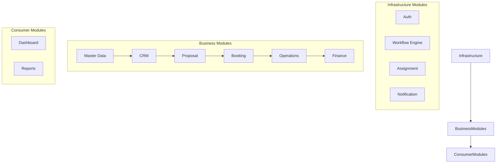

# 04 Module Interaction Specification (Production Certified)

This specification defines the communication paths, module boundaries, data ownership records, and event-driven workflows for the Amigos Tourism application. It serves as the definitive architecture reference for backend implementation, synchronized fully with the Frozen V3 Database Architecture.

---

## 1. Architectural Module Categorization

The codebase is organized into distinct layers to ensure separation of concerns:

- **Infrastructure Modules**: Standard utilities (authentication, side-effect event routing, audit assignment tracking, notifications).
- **Business Modules**: Manage the core transactional pipeline.
- **Consumer Modules**: Read-only modules aggregating statistics and analytical timelines.

---

## 2. Aggregate Roots & Transaction Boundaries

Aggregate boundaries define strict transactional consistency boundaries. Modifications to an aggregate root and its children must commit within a single database transaction.

### 2.1 CRM
- **Aggregate Root**: `Lead`
- **Children**: `LeadDestination`, `CRMActivity`, `FollowUp`
- **Lifecycle Ownership**: CRM manages the Lead from creation until it transitions into a Booking.
- **Transaction Boundary**: All updates to a Lead, its activities, or destinations occur in one transaction.

### 2.2 Proposal
- **Aggregate Root**: `Proposal`
- **Children**: `ProposalDestination`
- **Lifecycle Ownership**: Proposal handles versioning and pricing structures before booking confirmation.

### 2.3 Booking
- **Aggregate Root**: `Booking`
- **Children**: `Traveler`, `Document`, `PaymentSchedule`, `BookingStatusHistory`
- **Lifecycle Ownership**: Booking is the central business entity that maps the entire customer contract lifecycle.
- **Standalone Aggregates (Why Independent?)**:
  - `Task`: Tasks are independently assignable, completeable, and subtasked by different team members without acquiring a full lock on the Booking.
  - `VendorAllocation`: Vendors are allocated asynchronously. Operations teams negotiate quotes and lock allocations independently of the Customer booking.
  - `Checklist`: Checklists are distinct operational workflows with their own lifecycles.

### 2.4 Operations
- **Aggregate Root**: `TripPlan`
- **Children**: `TripDay`
- **Standalone Aggregates**: `Task`, `VendorAllocation`, `Checklist`

### 2.5 Finance
- **Aggregate Roots**: `Payment`, `VendorPayment`, `Expense`, `Refund`
- **Standalone Note**: Each financial record is an independent aggregate because money movements are immutable events that should never be bundled into a single massive transaction.

### 2.6 Transaction Boundary Definitions
- **Only the owning module controls COMMIT.**
- **Workflow Engine never participates in transactions.**
- **Events are published only after COMMIT.**

| Transaction Name | Owner | Resources Modified | Published Event | Rollback Scope |
| :--- | :--- | :--- | :--- | :--- |
| **Proposal Finalized** | Proposal | `Proposal.is_final` | `ProposalFinalized` | Proposal modifications only. |
| **Advance Received** | Finance | `Payment`, `PaymentSchedule` | `AdvanceReceived` | Financial ledger insertions only. |
| **Booking Created** | Booking | `Booking`, `Traveler`, `PaymentSchedule` | `BookingCreated` | Booking snapshot creations. |
| **Booking Confirmed** | Booking | `Booking.booking_status_id` | `BookingConfirmed` | Status updates. |
| **Trip Completed** | Operations | `TripPlan.status_id`, `VendorAllocation.status`| `TripCompleted` | Operational completion checks. |
| **Finance Closed** | Finance | Expenses locked | `FinanceClosed` | Finance validations. |

---

## 3. Ownership Rules & Module Communication Rules

### 3.1 Strict Entity Ownership
Every entity must have exactly one lifecycle owner.
- **Entity Owner**: Sole module allowed to mutate state.
- **Read Access**: Other modules may query via Service endpoints.
- **Write Access**: Restricted exclusively to the Owning Service.
- **Delete Authority**: Only the Owning Service manages soft deletes.
- **Audit Responsibility**: Owning module captures changes via `AuditMixin`.

### 3.2 Communication Rules
**Allowed:**
`Module` → `Own Service` → `Workflow Engine` → `Subscriber Service`

**Not Allowed:**
- `Repository` → `Repository` cross-module calls.
- `Model` → `Model` mutations across context boundaries.
- Cross-module transactions (distributed locks).
- Direct database writes to non-owned tables.
- Shared mutable state.

### 3.3 Cross-Module Dependency Matrix
All cross-module interactions rely on Event hooks or strict read-only queries.

| Module | Dependent On | Dependency Type | Reason |
| :--- | :--- | :--- | :--- |
| **CRM** | Master | Read Dependency | Fetching Packages, Destinations, Organizations for Leads. |
| **Proposal** | CRM | Event / Read | Triggered by Lead requests; reads Lead requirements. |
| **Booking** | Proposal, Finance | Event / Read | Reacts to `AdvanceReceived`, reads finalized Proposal details. |
| **Operations** | Booking | Event / Read | Reacts to `BookingConfirmed`, reads Travelers/Dates. |
| **Finance** | Operations, Booking | Event / Read | Reacts to `TripCompleted`, reads VendorAllocations for payments. |
| **Dashboard** | Business Modules | Read (Materialized) | Aggregating read models. |

---

## 4. Event Contract Documentation

All domain events follow Past Tense naming conventions, guaranteeing the transaction has committed. Subscribers must process events **idempotently**.

### `ProposalFinalized`
- **Publisher**: Proposal Module
- **Subscribers**: CRM, Booking, Workflow Engine
- **Trigger**: Customer formally approves the proposal pricing.
- **Payload Owner**: Proposal ID, Lead ID, Version, Occurred At.
- **Delivery Order**: Guaranteed (processed asynchronously).
- **Retry Strategy**: Exponential backoff up to 5 attempts; Dead Letter Queue on failure.

### `AdvanceReceived`
- **Publisher**: Finance Module
- **Subscribers**: Booking
- **Trigger**: Finance confirms receipt of the initial deposit.
- **Payload Owner**: Booking ID, Payment ID, Amount, Occurred At.

### `BookingConfirmed`
- **Publisher**: Booking Module
- **Subscribers**: Operations, Assignment, Notification
- **Trigger**: Trip Coordinator assigned and operations unlocked.
- **Payload Owner**: Booking ID, Coordinator ID.

### `TripCompleted`
- **Publisher**: Operations Module
- **Subscribers**: Finance, Booking
- **Trigger**: Execution phase concludes.
- **Payload Owner**: TripPlan ID, Booking ID.

---

## 5. Workflow Engine Guarantees

The Workflow Engine acts purely as an orchestrator and event bus.
**It owns:**
- **No tables**, **No repositories**, **No entities**, **No business rules.**

**It guarantees:**
- **Post-commit orchestration**: Events trigger strictly after database commits.
- **Ordered event routing**: Preserves sequence integrity.
- **Module decoupling**: Publishers never know who subscribes.
- **No distributed transactions**: Prevents distributed deadlock.
- **Retry-safe event processing**: Retries via background tasks (Celery/RQ).

---

## 6. Specific Infrastructure Responsibilities

### 6.1 Assignment Module Refinement
The Assignment module stores history only. It never owns operational entities or modifies Booking/Lead states. It simply audits transitions.
- **Assignment Types**: Lead Owner, Operations Owner, Trip Coordinator, Task Assignment.
- **Lifecycle**: Whenever an owning module changes a user foreign key (`owner_team_member_id`), it emits an event. The Assignment module intercepts this to log `AssignmentHistory`.

### 6.2 Notification Module Refinement
The Notification module is entirely reactive and never blocks business transactions.
- **Pipeline**: `Business Event` → `Workflow Engine` → `Notification Module` → `Template Resolution` → `Channel Selection` → `Delivery` → `Delivery History`.
- **Fault Tolerance**: Delivery failures (e.g. SMTP down) **must never rollback** business operations.

---

## 7. Read Model Strategy

Dashboard and Reports modules never participate in business transactions and never publish events.
**Pipeline**: `Operational Database` → `Read Model` → `Materialized View` → `Dashboard` / `Reports`.
- **Refresh Strategy**: Eventually consistent projections. Read models are synchronized via Event-triggered async jobs (e.g., updating a KPI cache when `BookingConfirmed` fires).
- **Read Consistency**: Fast UI dashboards read from denormalized views to prevent heavy table locks on the core aggregates.

---

## 8. Architecture Decision Records (ADR)

1. **Modular Monolith**: 
   - *Context*: Travel platform requires tight data consistency initially but needs to scale teams later.
   - *Decision*: Single application runtime, strict logical boundaries.
   - *Consequences*: High maintainability, zero network overhead now, easy extraction later.
2. **Domain Driven Design & Single Ownership**: 
   - *Decision*: Every table has one owner. Cross-module queries are strictly read-only or mediated by events.
3. **Event-Driven Coordination**: 
   - *Decision*: Post-transaction event hooks replace cross-module direct writes.
4. **Optimistic Locking**: 
   - *Decision*: Added `row_version` to Booking, TripPlan, Proposal to prevent silent concurrent overwrites.
5. **PostgreSQL & UUIDv4/JSONB**: 
   - *Decision*: Standardized on native PSQL types for maximum index performance and indexing flexibility.

---

## 9. Non-Functional Architecture

- **Scalability**: Stateless services + decoupled read models allow aggressive horizontal scaling.
- **Maintainability**: Strict DDD bounds mean developers only need to grok one bounded context to make safe changes.
- **Performance**: Materialized read models prevent dashboard queries from degrading transactional Booking performance.
- **Security**: Granular role-based access logic maps cleanly to service methods; credentials fully isolated in `Auth`.
- **Fault Isolation**: If the `Notification` or `Reports` module crashes, core `Booking` workflows remain unaffected.
- **Future Microservice Readiness**: See section 10.

---

## 10. Future Migration Strategy

The strict ownership rules guarantee that each module can be carved into an independent Microservice seamlessly.
**Example: Extracting Finance**
- *Current Boundary*: Separate folder/schema in the monolith.
- *Future Service*: Independent `Finance Service` with its own DB.
- *Database Ownership*: Extracts `payments`, `expenses`, `refunds`.
- *API Ownership*: Owns `/api/v1/finance/*`.
- *Consumed Events*: Subscribes to message queue for `TripCompleted`.
- *Published Events*: Publishes `AdvanceReceived` to the message broker.
- *Migration Difficulty*: Low. No foreign keys exist bridging Finance to Bookings natively (handled via UUID string storage).

---

## 11. Implementation Guidelines (Developer Guide)

1. **Module Structure**: 
   - `/app/modules/booking/models.py`, `services.py`, `repositories.py`, `events.py`.
2. **Repository Rules**: 
   - Repositories are the *only* layer allowed to execute SQLAlchemy queries. They strictly return Entities/DTOs.
3. **Service Rules**: 
   - Services handle business logic and orchestration. Services interact with Repositories and publish Events.
4. **DTO Rules**: 
   - APIs ingest and return Pydantic DTOs, never SQLAlchemy models directly.
5. **Event Rules**: 
   - Event handlers run asynchronously. They must be idempotent.
6. **Transaction Rules**: 
   - Transactions are scoped to the Service method. Services commit once per request.
7. **Exception Handling**: 
   - Services throw Domain Exceptions (e.g., `BookingNotFoundException`). API layer maps these to HTTP 404/400.
8. **Logging & Audit Rules**: 
   - All models inherit `AuditMixin` tracking `created_by` and `updated_by`.

---

## 12. PostgreSQL Implementation Notes (Frozen V3)

- **UUID Strategy**: `UUIDv4` selected for ecosystem compatibility.
- **Timestamp Policy**: All `DateTime` columns are enforced with `timezone=True` (UTC).
- **Monetary Precision Policy**: Financial fields enforce `Numeric(12, 2)`.
- **JSONB Usage Policy**: PostgreSQL `JSONB` implemented for `structured_itinerary`, `vendor_service_snapshot`, `tags`, and audit logs.
- **Foreign Key Delete Policy**: Strict adherence to `CASCADE` for children, `RESTRICT` for critical dependencies, and `SET NULL` for team member audit fields.
- **Partial Index Strategy**: Active record queries accelerated via `WHERE is_deleted = FALSE` partial indexes.

---

## 13. Consistency Audit & Final Review

A complete consistency review has been executed against the Database Architecture (Frozen V3), ER Diagram, and API plans:
- [x] Entity names match exactly.
- [x] Module ownership matches strictly.
- [x] Aggregate roots perfectly defined.
- [x] Transaction boundaries align with workflow phases.
- [x] No duplicated ownership or obsolete entities.
- [x] All workflows map perfectly to lifecycle statuses.

---

## 14. Module Interaction Certification

I, the Chief Software Architect, confirm the following have been universally verified and finalized:

- [x] Module boundaries are **frozen**.
- [x] Aggregate roots are **frozen**.
- [x] Ownership rules are **frozen**.
- [x] Workflow orchestration is **frozen**.
- [x] Event contracts are **frozen**.
- [x] Service interaction rules are **frozen**.
- [x] Transaction boundaries are **frozen**.
- [x] Read model strategy is **frozen**.
- [x] Infrastructure responsibilities are **frozen**.

**Declaration:** This document is now the official, definitive backend architecture reference for the Amigos Tourism Platform. No further architectural redesigns shall be initiated. Implementation and API specification generation may now proceed seamlessly based on this certified framework.
