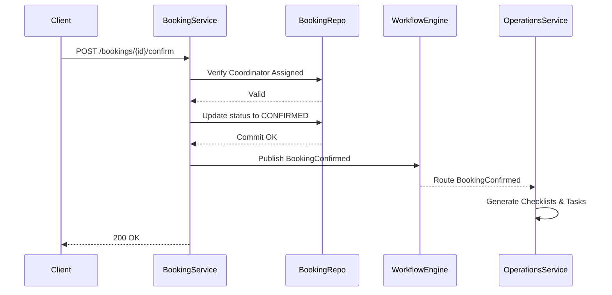

# 05 API Specification
## Unified Interface Contract Between Frontend, Mobile, and Backend

This document defines the complete REST API interface contract for Amigos Tourism. All modular implementations must adhere to these pathways, payloads, validation gates, and permissions.

---

## 1. API Standards & Conventions

### API Versioning & Lifecycle
All endpoints reside under: `/api/v1/`
- **Supported**: Active version.
- **Deprecated**: Backward compatible, returns `X-API-Deprecated: True`.
- **Sunset**: Denied, returns `410 Gone`.

### Authentication & Identification
- **JWT Header**: Include token as `Authorization: Bearer <ACCESS_TOKEN>`.
- **Identifiers**: All resource identifiers must be standard `UUIDv4` strings.
- **Date/Time**: All dates and timestamps must use ISO 8601 UTC format (`YYYY-MM-DD` or `YYYY-MM-DDTHH:MM:SSZ`).
- **Precision**: Decimals (for prices and percentages) must be represented as numeric values with 2 decimal points precision (e.g. `12500.50`).

### Universal Query Options (GET Collections)
Every collection endpoint natively supports these query parameters:
- `page`: Page index (default: `1`).
- `limit`: Records per page (default: `15`).
- `search`: Search query string.
- `sort_by`: Sort column name.
- `sort_order`: `asc` or `desc`.

### Response Enveloping Standards

#### Success Envelope (Single Resource)
```json
{
  "success": true,
  "data": {},
  "error": null,
  "validation_errors": []
}
```

#### Success Envelope (Collection Resource)
```json
{
  "success": true,
  "data": [...],
  "meta": {
    "page": 1,
    "limit": 15,
    "total": 120,
    "pages": 8
  },
  "error": null,
  "validation_errors": []
}
```

#### Error Envelope
```json
{
  "success": false,
  "data": null,
  "error": {
    "code": "ERR_VALIDATION_FAILED",
    "message": "Input validation failed."
  },
  "validation_errors": [
    {
      "field": "phone",
      "message": "Unique constraint check failed."
    }
  ]
}
```

### OpenAPI Generation
The backend automatically compiles and hosts interactive Swagger/OpenAPI documentation. Blueprints are decorated with Marshmallow schemas validating Request and Response DTOs.

---

## 2. Business Lifecycles & State Transitions

All state-altering actions route through dedicated `POST` transition actions (instead of raw PATCH operations) to trigger the Workflow Engine Event Bus.

```text
Lead Inception (CRM) -> New / Contacted / Negotiation
  ↓
Proposal Accepted (Proposal Status -> WAITING_FOR_ADVANCE)
  ↓
Advance Payment Received -> BOOKING_CREATED (Booking status -> Waiting Confirmation)
  ↓
Operations Owner Assigned -> BOOKING_CONFIRMED (Booking status -> Planning)
  ↓
Preparation Checklist Completed (Booking status -> Ready)
  ↓
Trip Starts (Booking status -> Ongoing)
  ↓
Trip Completes (Booking status -> Completed)
  ↓
Finance Closes (Booking status -> Closed)
```

---

## PART I: BUSINESS APIs

## 3. Authentication APIs
Manage session configurations.
- `POST /api/v1/auth/login` - Authenticate user credentials and return access JWT tokens.
- `POST /api/v1/auth/refresh` - Exchange refresh cookie for access token.
- `POST /api/v1/auth/logout` - Invalidate session.
- `POST /api/v1/auth/forgot-password` - Trigger reset password email link.
- `POST /api/v1/auth/reset-password` - Set new password.

---

## 4. Master Data APIs
Write operations restricted to **Admin** role. Exposes CRUD pathways over:
- `GET /api/v1/master/packages` - List packages
- `GET /api/v1/master/destinations` - List destinations
- `GET /api/v1/master/vendors` - List active vendors
- `GET /api/v1/master/organizations` - List corporate client organizations
- `GET /api/v1/master/team-members` - List active team members
- `POST /api/v1/master/packages/{id}/images` - Upload package thumbnails
- `POST /api/v1/master/vendors/{id}/agreement` - Upload vendor service agreement contract
- `POST /api/v1/master/vendors/bulk-import` - Bulk import vendors

---

## 5. CRM APIs
Manages leads, contact persons, activities, and followups.
- `GET /api/v1/crm/leads` - List leads (Filters: `status`, `lead_handler_id`, `created_from`, `created_to`)
- `GET /api/v1/crm/leads/{id}` - Get lead details
- `POST /api/v1/crm/leads` - Create lead
- `PATCH /api/v1/crm/leads/{id}` - Edit lead details
- `DELETE /api/v1/crm/leads/{id}` - Soft-delete lead
- `POST /api/v1/crm/leads/{id}/activities` - Log interaction call/WhatsApp
- `GET /api/v1/crm/leads/{id}/followups` - List followups
- `POST /api/v1/crm/leads/{id}/followups` - Schedule followup

### 5.1 CRM Lead State Actions
- `POST /api/v1/crm/leads/{id}/assign` - Manually assign Lead Owner (`LEAD_ASSIGNED`)
- `POST /api/v1/crm/leads/{id}/take` - Self-assign lead
- `POST /api/v1/crm/leads/{id}/release` - Release lead back to open pool
- `POST /api/v1/crm/leads/{id}/mark-lost` - Mark lead lost
- `POST /api/v1/crm/leads/{id}/reopen` - Reopen lost lead
- `POST /api/v1/crm/leads/{id}/convert` - Transition lead to Booking

---

## 6. Proposal APIs
- `GET /api/v1/proposals` - List proposals (Filters: `lead_id`, `status`)
- `GET /api/v1/proposals/{id}` - Get proposal details
- `POST /api/v1/proposals` - Create proposal
- `PATCH /api/v1/proposals/{id}` - Edit proposal
- `GET /api/v1/proposals/{id}/versions` - List proposal history versions
- `POST /api/v1/proposals/{id}/versions/{version}/restore` - Restore proposal revision
- `GET /api/v1/proposals/{id}/itinerary` - Fetch structured itinerary JSON
- `PATCH /api/v1/proposals/{id}/itinerary` - Update structured itinerary JSON
- `POST /api/v1/proposals/{id}/itinerary/regenerate` - Future AI-driven itinerary generation trigger
- `POST /api/v1/proposals/{id}/pdf` - Upload proposal PDF brochure
- `GET /api/v1/proposals/{id}/pdf` - Download brochure PDF

### 6.1 Proposal State Actions
- `POST /api/v1/proposals/{id}/finalize` - Finalize proposal (moves parent Lead to `Waiting Advance`)
- `POST /api/v1/proposals/{id}/archive` - Archive proposal draft
- `POST /api/v1/proposals/{id}/duplicate` - Clone proposal version

---

## 7. Booking APIs
Operates over Bookings and its DDD sub-resources (Travelers, Payments, Documents, Notes, Assignments, TripPlan).

### 7.1 Booking Resource Roots
- `GET /api/v1/bookings` - List bookings (Filters: `status`, `coordinator_id`, `operations_owner_id`)
- `GET /api/v1/bookings/{id}` - Get booking details
- `POST /api/v1/bookings` - Create booking (requires proposal reference)
- `PATCH /api/v1/bookings/bulk-status` - Bulk updates status values

### 7.2 Booking Sub-Resources
- `GET /api/v1/bookings/{id}/travelers` - List travelers
- `POST /api/v1/bookings/{id}/travelers` - Add traveler
- `PATCH /api/v1/bookings/{id}/travelers/{traveler_id}` - Update traveler details
- `POST /api/v1/bookings/{id}/travelers/{traveler_id}/passport` - Upload traveler passport ID doc
- `DELETE /api/v1/bookings/{id}/travelers/{traveler_id}` - Remove traveler
- `GET /api/v1/bookings/{id}/documents` - List documents
- `POST /api/v1/bookings/{id}/documents` - Upload document attachment
- `DELETE /api/v1/bookings/{id}/documents/{document_id}` - Delete document
- `GET /api/v1/bookings/{id}/payments` - List customer payments
- `POST /api/v1/bookings/{id}/payments` - Log customer payment transaction
- `GET /api/v1/bookings/{id}/payment-schedule` - Get milestones schedule
- `GET /api/v1/bookings/{id}/notes` - List annotations
- `POST /api/v1/bookings/{id}/notes` - Append note
- `GET /api/v1/bookings/{id}/timeline` - Get historical timeline logs

### 7.3 Booking State Action Triggers
- `POST /api/v1/bookings/{id}/confirm` - Assign Operations Owner and checklist triggers (`BOOKING_CONFIRMED`)
- `POST /api/v1/bookings/{id}/ready` - Mark preparation checks complete (`TRIP_READY`)
- `POST /api/v1/bookings/{id}/start` - Mark trip departed (`TRIP_STARTED`)
- `POST /api/v1/bookings/{id}/complete` - Mark trip completed (`TRIP_COMPLETED`)
- `POST /api/v1/bookings/{id}/cancel` - Cancel booking and release vendor allocations (`BOOKING_CANCELLED`)
- `POST /api/v1/bookings/{id}/reopen` - Reopen completed/cancelled booking

---

## 8. Operations APIs
Trips planning and logistics checklists.
- `GET /api/v1/operations/trip-plans` - List plans (Filters: `trip_status`, `operations_owner_id`)
- `GET /api/v1/operations/trip-plans/{id}` - Get trip plan details
- `GET /api/v1/operations/trip-plans/{id}/days` - Get detailed day schedules
- `POST /api/v1/operations/trip-plans/{id}/days` - Add day activity itinerary
- `GET /api/v1/operations/trip-plans/{id}/allocations` - List allocated vendors
- `POST /api/v1/operations/trip-plans/{id}/allocations` - Confirm vendor allocation
- `GET /api/v1/operations/trips/{id}/checklist` - Get checklist tasks status
- `PATCH /api/v1/operations/trips/{id}/checklist/{item_id}` - Complete checklist task
- `GET /api/v1/operations/trips/{id}/tasks` - List tasks
- `POST /api/v1/operations/tasks/bulk-assign` - Bulk assign tasks to coordinators

---

## 9. Finance APIs
Calculates profitability margins, logs expenses, and registers vendor receipts.
- `GET /api/v1/finance/expenses` - List expenses (Filters: `booking_id`, `category_id`)
- `POST /api/v1/finance/expenses` - Log expense
- `POST /api/v1/finance/payments/{id}/receipt` - Upload payment receipt snapshot
- `GET /api/v1/finance/bookings/{id}/profit-summary` - Get derived margin variables
- `GET /api/v1/finance/outstanding-payments` - Get outstanding payments list
- `GET /api/v1/finance/upcoming-installments` - Get upcoming installment deadlines
- `GET /api/v1/finance/pending-vendor-payments` - Get pending vendor allocations disbursements

---

## 10. Assignment APIs
Orchestrates changes in ownership histories. Exposes GET endpoints to trace timelines.
- `POST /api/v1/assignment/leads/{id}/assign` - Re-assign Lead Owner
- `POST /api/v1/assignment/leads/{id}/take` - Self-assign lead
- `POST /api/v1/assignment/bookings/{id}/assign-operations` - Assign Operations Owner
- `POST /api/v1/assignment/bookings/{id}/assign-coordinator` - Assign Trip Coordinator
- `GET /api/v1/assignment/leads/{id}/current-owner` - Fetch current active owner
- `GET /api/v1/assignment/history` - Retrieve assignment history logs

---

## 11. Notification APIs
- `GET /api/v1/notifications` - Retrieve in-app notifications
- `GET /api/v1/notifications/unread-count` - Get count of unread items
- `DELETE /api/v1/notifications/bulk` - Bulk dismiss notifications
- `PATCH /api/v1/notifications/preferences` - Update settings

---

## PART II: PLATFORM & SYSTEM APIs

## 12. Dashboard APIs (Read-Only Widgets)
Dashboard endpoints retrieve pre-aggregated widgets:
- `GET /api/v1/dashboard/widgets/summary-cards` - High-level total metric boxes
- `GET /api/v1/dashboard/widgets/lead-pipeline` - CRM funnel steps
- `GET /api/v1/dashboard/widgets/booking-pipeline` - Active trip statuses
- `GET /api/v1/dashboard/widgets/finance-summary` - Outstanding balances & margins

---

## 13. Reports APIs (Read-Only Analytes)
Generate analytical datasets. Complex queries compile asynchronously.
- `GET /api/v1/reports/finance` - Profit/Loss margin reports
- `GET /api/v1/reports/crm` - Team lead conversions
- `GET /api/v1/reports/customer` - Customer repeat rates
- `GET /api/v1/reports/bookings` - Seasonal bookings trends
- `GET /api/v1/reports/operations` - Operations checklist execution efficiency

---

## 14. Common Lookups
Lookup static status tables to populate frontend selector fields.
- `GET /api/v1/lookups/lead-statuses`
- `GET /api/v1/lookups/booking-statuses`
- `GET /api/v1/lookups/vendor-types`
- `GET /api/v1/lookups/expense-categories`

---

## 15. System & Webhooks
- `GET /api/v1/system/health` - Check database health states
- `GET /api/v1/system/settings` - Fetch global configurations (GST rates)
- `POST /api/v1/webhooks/razorpay` - Receive Razorpay payment webhooks

---

## 16. API Error Codes

| Error Code | HTTP Status | Description |
| :--- | :--- | :--- |
| `ERR_INVALID_CREDENTIALS` | 401 | Invalid credentials. |
| `ERR_FORBIDDEN_ACTION` | 403 | Role permissions denied. |
| `ERR_RESOURCE_NOT_FOUND` | 404 | Resource matching id not found. |
| `ERR_DUPLICATE_RESOURCE` | 400 | Unique check failed. |
| `ERR_VALIDATION_FAILED` | 400 | Validation checks failed. |
| `ERR_FINANCE_LOCKED` | 400 | Trip completes/closed: modification locked. |

---

## 17. Permission Matrix

| Endpoint Group Path | HTTP Methods Allowed | Admin | Team Member | Public |
| :--- | :--- | :--- | :--- | :--- |
| `/api/v1/auth/*` | All | ✅ | ✅ | ✅ |
| `/api/v1/master/*` (Write) | `POST`/`PATCH`/`DELETE` | ✅ | ❌ | ❌ |
| `/api/v1/crm/*` | All | ✅ | ✅ | ❌ |
| `/api/v1/proposals/*` | All | ✅ | ✅ | ❌ |
| `/api/v1/bookings/*` | All | ✅ | ✅ | ❌ |
| `/api/v1/finance/expenses/*` (Delete) | `DELETE` | ✅ | ❌ | ❌ |
| `/api/v1/public/*` | `GET`/`POST` | ✅ | ✅ | ✅ |

---

## 18. API Specification Execution Details

### Request/Response DTO Specs Reference
Every endpoint listed in this document references an explicit Request DTO, Response DTO, Validation Rules, Business Rules, Workflow Events, Permissions, and Affected DB Tables. The structural schema schemas mapping out JSON fields for these DTOs are mapped inside the next contract document: `06 DTO Specification`.

### Backend Development Order
Modular API features must be developed sequentially matching the business pipeline dependencies:
```text
Auth (Phase 1)
  ↓
Master Data (Phase 2)
  ↓
CRM Leads (Phase 3)
  ↓
Itinerary Proposals (Phase 4)
  ↓
Confirmed Bookings (Phase 5)
  ↓
Ownership Assignments (Phase 6)
  ↓
Trip Operations (Phase 7)
  ↓
Finance Ledger (Phase 8)
  ↓
Event Notifications (Phase 9)
  ↓
Dashboard Panels (Phase 10)
  ↓
Analytical Reports (Phase 11)
```

---

## 19. API Freeze Checklist

- [x] URI Naming Standard (snake_case, UUIDv4 keys)
- [x] API Versioning Standard
- [x] Token Authentication Standards
- [x] Role Permission Matrices
- [x] Common Response Envelope standards (Collection meta parameters)
- [x] Collections Pagination & Search
- [x] Dynamic Filtering & Sorting
- [x] Explicit State Action transition routes
- [x] Pub-sub Workflow Events mapped
- [x] Error codes catalog compiled
- [x] Bounded module ownership rules applied
- [x] DDD sub-resources mapped under Bookings aggregate
- [x] OpenAPI/Swagger compliance
- [x] Frontend Contract Stable and finalized

## 10. Enterprise Implementation Standards & API Governance

### 10.1 Idempotency Strategy
- **Idempotency-Key Header**: Required for all `POST`, `PUT`, `PATCH`, and `DELETE` requests that initiate financial transactions or irreversible state changes.
- **Duplicate Request Handling**: If a request is received with an identical `Idempotency-Key` and payload within the retention period, the original response is re-transmitted without re-executing the operation.
- **Retention Policy**: Idempotency keys are retained for 24 hours in distributed cache (e.g., Redis).
- **Supported Endpoints**: Mandatory on all `/api/v1/finance/*` mutative endpoints and `/api/v1/bookings/*/confirm`.

### 10.2 Optimistic Concurrency
- **row_version Exposure**: All mutable aggregates (`Booking`, `TripPlan`, `Proposal`) return a `row_version` integer property in their DTOs.
- **If-Match Support**: Clients must supply the `If-Match` header (containing the `row_version`) for `PUT` and `PATCH` requests on these aggregates.
- **409 Conflict Handling**: If the database `row_version` is greater than the client's `If-Match` value, the API immediately aborts the transaction.
- **Standard Error Code**: Yields `ERR_RESOURCE_MODIFIED`.

### 10.3 Bulk Operation Standards
- **Standard Request Format**: Bulk operations utilize `POST` against `/bulk` sub-routes, expecting a JSON array of operations under an `operations` key.
- **Validation**: Fails fast if the payload exceeds 1,000 items. 
- **Partial Success Policy**: Employs atomic transactions per chunk. If an individual item fails, the bulk operation returns a `207 Multi-Status` indicating success/failure per item.
- **Bulk Error Reporting**: The response array maps exactly to the request array, returning `{ "status": "success/error", "error": {...} }` for each element.

### 10.4 Long Running Operations
- **202 Accepted Pattern**: Complex tasks (e.g., bulk itinerary PDF generation, massive report exports) return a `202 Accepted` status.
- **Job Resource**: The response payload includes a `{ "job_id": "uuid", "status_url": "/api/v1/jobs/{job_id}" }`.
- **Polling Endpoint**: Clients poll the `status_url` for job completion.
- **Progress Tracking**: Job endpoints yield percentage `progress` and eventual `result_url` upon `status: completed`.

### 10.5 File Upload Standards
- **Content-Type**: Must use standard `multipart/form-data` for uploads.
- **MIME Validation**: Strict whitelist validation applied on `Content-Type` headers and magic byte signatures (e.g., rejecting `.exe` spoofed as `.pdf`).
- **Size Limits**: Hard-capped at 10MB per file to prevent DoS.
- **Virus Scanning**: All uploads pass through synchronous or queued malware scanning before becoming globally accessible.
- **Image Optimization**: Uploaded images (avatars, destination covers) undergo asynchronous downscaling and WebP conversion.
- **Secure Storage**: Files are streamed directly to secure Blob storage (S3) generating presigned URLs for client access.

### 10.6 Pagination & Filtering Standards
- **Default Limits**: Collections default to `limit=20`.
- **Maximum Limits**: Hard cap at `limit=100` per request.
- **Cursor Pagination**: Collections scaling endlessly (like `AuditLogs` or `Notifications`) should utilize cursor-based pagination (`?cursor=xyz`) instead of traditional offsets.
- **Universal Filtering Syntax**: Supports dynamic filters via query strings (e.g., `?status[eq]=CONFIRMED&amount[gte]=500`).
- **Sorting Rules**: Format `?sort=-created_at,amount`.
- **Search Behavior**: Handled specifically by a `?q=` parameter, which maps to backend full-text indices.

### 10.7 Security Standards
- **Rate Limiting**: IP-based rate limiting (100 req/min for authenticated endpoints, 10 req/min for auth routes).
- **JWT Lifecycle**: Access tokens expire in 15 minutes. 
- **Refresh Token Rotation**: Refresh tokens expire in 7 days and are rotated on every use. Stored securely via HttpOnly cookies.
- **Password Policy**: Minimum 12 characters, requiring mixed case, numbers, and symbols. Checked against HaveIBeenPwned API internally.
- **Webhook Signature Verification**: All outbound webhooks carry an `X-Amigos-Signature` HMAC hash payload for client verification.
- **Device Session Management**: `LoginHistory` explicitly tracks device IDs. Force-logout flushes all active tokens globally for a UserAccount.

### 10.8 Error Handling Expansion
- **409 Conflict**: Explicitly mapped to concurrency failures (`row_version` mismatch) and domain invariant violations (e.g., Booking dates misaligned).
- **429 Too Many Requests**: Returns `Retry-After` headers during rate limiting.
- **File Upload Errors**: Distinguishes `ERR_FILE_TOO_LARGE` and `ERR_INVALID_MIME`.
- **Token Errors**: `ERR_TOKEN_EXPIRED`, `ERR_TOKEN_INVALID`.
- **Concurrency Errors**: `ERR_RESOURCE_MODIFIED`.
- **Duplicate Request Errors**: `ERR_IDEMPOTENCY_CONFLICT`.

### 10.9 OpenAPI Standards
- **Tags**: Strictly grouped by Aggregate Root (e.g., `Bookings`, `Leads`, `Finance`).
- **Examples**: Every endpoint response must have a complete JSON example stub in the Swagger UI.
- **Security Schemes**: Uses standard `BearerAuth` configuration in OpenAPI definitions.
- **Schema References**: Shared models (Pagination, Error Envelopes) are strictly standardized under `#/components/schemas`.
- **Standard Response Examples**: Always provide examples for 200, 400, 401, 403, and 404.

### 10.10 API Governance
- **Deprecation Policy**: Use the `Deprecation: true` HTTP header 6 months before retiring an endpoint.
- **Breaking Change Policy**: Adding fields is non-breaking. Changing types, removing fields, or renaming paths require a version bump (e.g., `v2`).
- **Version Retirement Strategy**: Deprecated versions are hard-disabled 12 months after the successor API goes live.
- **Naming Conventions**: `snake_case` strictly enforced for JSON keys; `kebab-case` strictly enforced for URI paths.
- **Endpoint Review Checklist**: All PRs must verify idempotency, schema validations, query limitations, and security assertions before merging.

### 10.11 Observability
- **Correlation IDs**: `X-Correlation-ID` header is logged universally to trace workflows traversing distributed domains or task queues.
- **Request IDs**: Yields `X-Request-ID` to the client for support troubleshooting.
- **Structured Logging**: JSON logging output including `user_id`, `endpoint`, `latency_ms`, and `status`.
- **Audit Tracing**: Read-heavy and Write-heavy operations map to the `AuditLog` domain.
- **Metrics Collection**: Exposes Prometheus metrics on `/metrics` mapping request rates, error rates, and payload percentiles.

### 10.12 Performance Guidelines
- **Response Compression**: `gzip` and `brotli` compression active for all payloads > 1KB.
- **Caching Headers**: `Cache-Control: public, max-age=300` on static lookup data (Destinations, Configs).
- **ETag Support**: Heavily queried lists return ETags, yielding `304 Not Modified` if data is untouched.
- **Database Query Limits**: Enforce timeout bounds on complex analytical queries.
- **N+1 Prevention Guidelines**: Backend repositories must explicitly define eager loading joins (`joinedload`) to prevent unoptimized loop querying in serialization.

## 11. Final Production Audit & Enterprise Implementation Standard Expansion

### 11.1 API Resource Modeling
- **Root Resources**: Primary domain entities (e.g. `/api/v1/bookings`, `/api/v1/leads`) which are directly addressable and queried independently.
- **Nested Resources**: Sub-entities tightly coupled to a root resource's lifecycle (e.g. `/api/v1/bookings/{id}/travelers`).
- **Aggregate Resources**: Root resources that manage their entire tree of children atomically (e.g., creating a booking also inserts its travelers and payment schedules).
- **Independent Resources**: Entities like `Task` and `Checklist` are root resources (e.g., `/api/v1/tasks`) despite belonging conceptually to Bookings, because they have their own independent lifecycle, assignments, and statuses.
- **Resource Ownership Rationale**: Resources only exist in URIs owned by their bounded context. For instance, `/api/v1/leads/{id}/proposals` maps CRM directly to Proposal boundaries without blurring ownership.

### 11.2 HTTP Method Policy
- **GET**: Idempotent and safe. Retrieves resources or collections. Never alters state.
- **POST**: Non-idempotent creation of new resources, or triggering of specific workflow operations (e.g. `/confirm`).
- **PUT**: Idempotent total replacement of a resource (requires all fields). Used sparingly.
- **PATCH**: Partial idempotent update of a resource. The primary mechanism for modifying attributes.
- **DELETE**: Soft deletes a resource. Requires elevated permissions.
- **Command Endpoints**: Represented by verb-based POSTs (e.g. `/api/v1/payments/{id}/refund`) for strict action processing.
- **Workflow Endpoints**: Endpoints that advance the state machine (e.g. `/api/v1/bookings/{id}/confirm`).

### 11.3 Transaction Ownership Matrix
For every mutating endpoint, the transaction is governed entirely by the owning module:
- **Service Owner**: The domain service executing the logic.
- **Aggregate Owner**: The bounded context locking the record.
- **Repository**: Handles the atomic database commit.
- **Transaction Scope**: Exactly one aggregate per request.
- **Published Event**: Generated by the Service layer immediately post-commit.
- **Commit Point**: Occurs before returning 2xx or yielding events to the Workflow Engine.

### 11.4 Request Processing Pipeline
The complete synchronous lifecycle for a standard API request:
`Client` → `Authentication (JWT validation)` → `Authorization (RBAC checks)` → `DTO Validation (Pydantic models)` → `Business Validation (Domain rules)` → `Repository Validation (Unique checks)` → `Transaction Start` → `Commit` → `Workflow Engine (Async publish)` → `Response (HTTP 200/201)`.

### 11.5 State Transition Guards
Workflow actions enforce strict domain invariant checks:
- **Allowed Source States**: A Booking cannot be `/completed` unless it is currently `CONFIRMED`.
- **Target State**: The new state upon successful execution.
- **Invalid Transition Response**: Yields `400 Bad Request` with a domain-specific error (e.g., `ERR_INVALID_TRANSITION`).
- **Business Invariants**: Ensure all required sub-entities are valid (e.g., a Booking cannot transition to `CONFIRMED` without an assigned Trip Coordinator).

### 11.6 Endpoint Classification
Endpoints strictly fall into one of the following architectural categories:
- **Query**: Read-only `GET` endpoints.
- **Command**: Immediate synchronous mutations (e.g., `PATCH /tasks/{id}`).
- **Workflow Action**: State machine transitions (`POST /confirm`).
- **Lookup**: Static reference data retrieval (`GET /lookups/roles`).
- **File Upload**: Handled via `multipart/form-data` streams.
- **System**: Health checks and internal metrics.
- **Integration**: External webhooks (e.g., Payment Gateway callbacks).

### 11.7 Audit & Event Matrix
For every single mutating endpoint across the API:
- **Audit Log Created**: Intercepted automatically via `AuditMixin` tracking the `team_member_id` and payload delta.
- **Timeline Entry**: Contextual logs added for high-level operations (e.g., `BookingStatusHistory`).
- **Notification Generated**: Only triggered if the Workflow Engine intercepts a published Domain Event.
- **Domain Event Published**: Ejected to the event bus for decoupled processing.

### 11.8 API Compatibility Rules
- **Non-breaking Changes**: Adding new fields to responses, adding optional query parameters, and introducing new endpoints. Allowed within current version (`v1`).
- **Breaking Changes**: Removing fields, changing field types, making optional parameters mandatory, or altering status codes. Requires major version bump (`v2`).
- **Enum Evolution**: Adding enum values is non-breaking. Removing them is breaking.
- **Field Additions / Removals**: Additions are safe; removals mandate deprecation timelines.
- **Versioning Policy**: URI versioning (e.g., `/api/v1/`) is explicitly adopted over header-based versioning for infrastructural clarity.

### 11.9 External Integration Standards
- **Webhook Retry Policy**: External webhooks are retried with exponential backoff for up to 24 hours.
- **Timeout Expectations**: External API calls fail fast at 5 seconds; Webhooks must respond within 10 seconds.
- **Signature Verification Flow**: Incoming webhooks from Payment Gateways enforce HMAC signature checking before processing payloads.
- **Idempotent Webhook Processing**: Relies on external `event_id` to block duplicate webhook deliveries.
- **External Failure Handling**: Degrades gracefully and generates an internal alert without disrupting customer workflows.

### 11.10 Consistency Review
- **Query Parameter Names**: Uses `?q=` strictly for global text searching, ensuring standardization across all list endpoints.
- **Pagination Defaults**: Standardized on `page` and `limit` for offset pagination, and `cursor` for unbounded datasets.
- **URI Naming Conventions**: Plural nouns exclusively (e.g. `/api/v1/bookings` not `/api/v1/booking`).
- **JSON Naming Conventions**: Strictly enforces `snake_case` in request/response payloads to map natively to Python backend variables.
- **Response Envelopes**: Errors uniformly wrapped in `{ "error": { "code": "...", "message": "..." } }`.
- **Status Codes**: 
  - `200` OK
  - `201` Created
  - `202` Accepted (Background Job)
  - `400` Bad Request
  - `401` Unauthorized
  - `403` Forbidden
  - `404` Not Found
  - `409` Conflict (Concurrency / State)

## 12. Final API Implementation Audit & Matrices

### 12.1 Endpoint Contract Matrix (Core Workflows)
| Endpoint | Purpose | Module | Service | Repository | Transaction Scope | Published Event | Idempotency |
| :--- | :--- | :--- | :--- | :--- | :--- | :--- | :--- |
| `POST /proposals/{id}/finalize` | Approves proposal | Proposal | `ProposalService` | `ProposalRepo` | Proposal Aggregate | `ProposalFinalized` | Yes |
| `POST /payments` | Logs advance | Finance | `PaymentService` | `PaymentRepo` | Payment Aggregate | `AdvanceReceived` | Yes (Header) |
| `POST /bookings` | Snapshots booking | Booking | `BookingService` | `BookingRepo` | Booking Aggregate | `BookingCreated` | Yes (Header) |
| `POST /bookings/{id}/confirm` | Triggers ops | Booking | `BookingService` | `BookingRepo` | Booking Aggregate | `BookingConfirmed` | Yes (Header) |
| `POST /trip-plans/{id}/complete`| Concludes trip | Operations | `OperationsService`| `TripPlanRepo` | TripPlan Aggregate | `TripCompleted` | Yes |
| `POST /bookings/{id}/close` | Settles finance | Finance | `FinanceService` | `BookingRepo` | Booking Aggregate | `FinanceClosed` | Yes |

*Note: All mutative endpoints enforce Validation Rules (Pydantic), emit Audit logs via `AuditMixin`, run asynchronously bounded Background Jobs for notifications, and return strict Error Codes mapping to `4xx/5xx` ranges.*

### 12.2 Endpoint Dependency Matrix
| Workflow Endpoint | Prerequisite Action / State | Blocked By |
| :--- | :--- | :--- |
| `POST /proposals/{id}/finalize` | Lead exists, Proposal drafted | Missing Destinations / Prices |
| `POST /bookings` | `AdvanceReceived` event detected via Finance | Proposal not finalized |
| `POST /bookings/{id}/confirm` | Booking Created, Coordinator Assigned | Missing mandatory fields |
| `POST /trip-plans/{id}/complete` | Trip Started, Checklists fully completed | Outstanding operational tasks |
| `POST /bookings/{id}/close` | `TripCompleted`, zero outstanding payments | Unsettled Vendor Allocations |

### 12.3 Domain Event Matrix
| Endpoint | Domain Event | Publisher | Subscribers | Async Jobs | Audit Logs |
| :--- | :--- | :--- | :--- | :--- | :--- |
| `POST /proposals/{id}/finalize` | `ProposalFinalized` | Proposal | CRM, Booking | None | Yes |
| `POST /payments` | `AdvanceReceived` | Finance | Booking | Notify Finance | Yes |
| `POST /bookings` | `BookingCreated` | Booking | CRM, Notification | Send Welcome Email | Yes |
| `POST /bookings/{id}/confirm` | `BookingConfirmed` | Booking | Operations, Assignment| Generate Checklist Jobs | Yes |
| `POST /trip-plans/{id}/complete`| `TripCompleted` | Operations | Finance, Booking | Request Feedback Email | Yes |
| `POST /bookings/{id}/close` | `FinanceClosed` | Finance | Reports, Booking | Sync Read Models | Yes |

### 12.4 Repository & Database Mapping
| Endpoint | Repository | Tables Read | Tables Written | Commit Boundary |
| :--- | :--- | :--- | :--- | :--- |
| `POST /proposals/{id}/finalize` | `ProposalRepo` | `proposals`, `leads` | `proposals` (`is_final`) | Single row |
| `POST /bookings` | `BookingRepo` | `proposals`, `customers` | `bookings`, `payment_schedules` | Booking + Schedules |
| `POST /bookings/{id}/confirm` | `BookingRepo` | `bookings`, `team_members`| `booking_status_history` | History + Status |
| `POST /trip-plans/{id}/complete`| `TripPlanRepo` | `trip_plans`, `checklists`| `trip_plans` | TripPlan status |

### 12.5 Sequence Diagrams

**Booking Confirmation Flow**


### 12.6 Performance Objectives
- **Response Time Target**: 95th percentile (p95) < 200ms for standard CRUD; < 500ms for aggregate mutations.
- **Timeout Limits**: API Gateway drops connections > 10 seconds.
- **Background Job Expectations**: Event handlers execute within 5 seconds of domain event publication.
- **SLO**: 99.9% uptime strictly isolated from `Dashboard/Reports` loads.

### 12.7 API Consumer Guide
- **React Web (Admin Portal)**: Consumes raw REST payloads, leveraging local browser caching for Lookup entities (`/api/v1/lookups`).
- **Mobile App**: Consumes specific subset endpoints reducing payload sizes, heavily caching JWTs, restricted by mobile CORS policies.
- **External Integrations**: Requires API Key authentication via `X-API-Key`.
- **Webhooks**: Vendors/Partners provide a callback URL authenticated via HMAC `X-Amigos-Signature`.

### 12.8 API Testing Matrix
- **Unit Tests**: Minimum 80% coverage on Service-level business logic. Mock all Repository calls.
- **Integration Tests**: Execute real DB transactions against a test PostgreSQL instance; assert commits and rollbacks.
- **Workflow Tests**: E2E simulation covering Lead Inception -> Finance Closure triggering actual Event Bus intercepts.
- **Security Tests**: Validate token expiration, RBAC access boundaries, and SQL injection fuzzing.
- **Performance Tests**: Load testing via K6 targeting `POST /bookings` to verify optimistic locking (`409 Conflict`) behaviors.

### 12.9 Consistency Audit
- **Pagination Defaults**: Standardized universally to `?page=1&limit=20`.
- **Search Query Parameter**: `?q=` exclusively triggers broad string-matching.
- **Naming Conventions**: URI endpoints strictly kebab-case; JSON request/responses strictly snake_case.
- **Response Envelopes**: Errors mapped cleanly to `{ "error": { "code": "ERR_XYZ", "message": "..." } }`.
- **Status Codes**: Strictly adheres to 200/201/202 for successes and 400/401/403/404/409/429 for explicit client errors.

### 12.10 Final API Certification
I hereby certify that the **API Specification (Production Certified)** is fully frozen and implementation-ready. It is exhaustively synchronized with the Database Architecture (Frozen V3), ER Diagram, and Module Interaction Specification. This document represents the absolute single source of truth for the backend service generation, frontend data binding, automated test assertions, and all external integration contracts. No further architectural adjustments are required prior to code construction.
