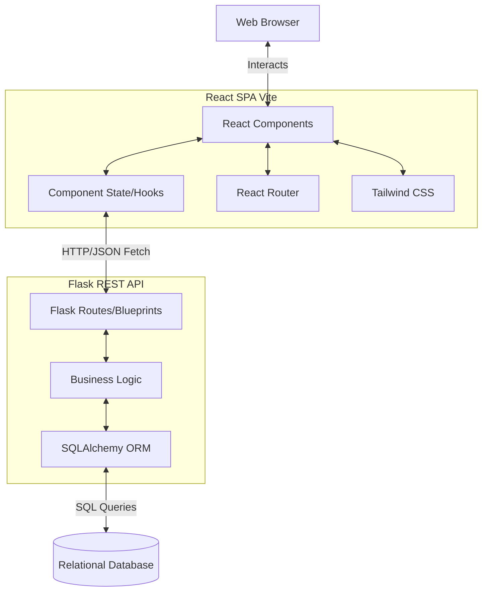
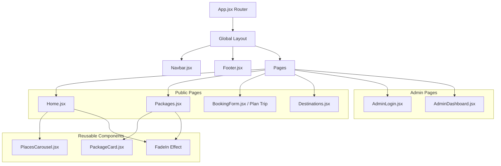
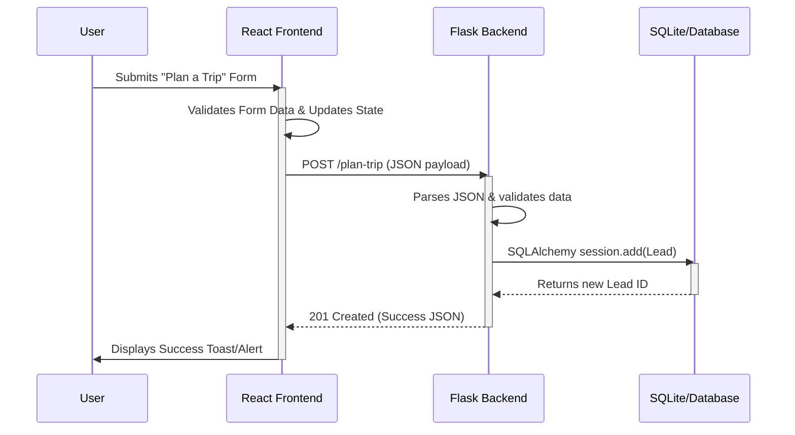
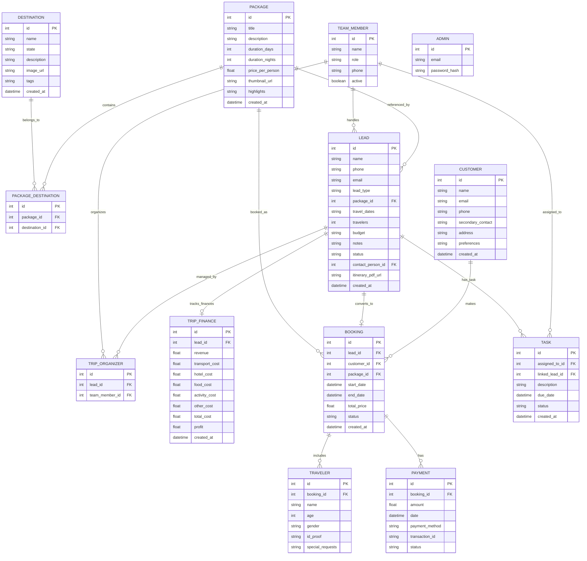

# Amigos Tourism Application Architecture

This document provides a comprehensive technical overview of the Amigos application, including system architecture, data flow, component structure, and database design.

## 1. High-Level System Architecture

The application follows a decoupled client-server architecture. The frontend is a Single Page Application (SPA), while the backend is a RESTful API.

## 2. Component Structure (Frontend)

The frontend uses React and is structured around reusable UI components and specialized pages.

## 3. Data Flow Diagram

The data flow illustrates how user actions propagate from the frontend to the backend database.

## 4. Entity-Relationship (ER) Diagram

The backend relies on a relational database managed by SQLAlchemy. Below is the main schema structure.

## 5. Technical Stack Summary

### Frontend 
* **Framework:** React 18, Vite
* **Styling:** Tailwind CSS (Custom animations in `tailwind.config.js`)
* **Routing:** react-router-dom
* **State Management:** Native Hooks (`useState`, `useEffect`)

### Backend
* **Framework:** Python, Flask
* **ORM:** Flask-SQLAlchemy
* **CORS:** Flask-CORS for cross-origin API integration
* **Database:** Relational db (e.g. SQLite mapped by SQLAlchemy models)

### Key Architectural Decisions
1. **Separation of Concerns:** Clear boundary between the UI implementation detail and data persistence via API routes.
2. **REST Principles:** Usage of standard HTTP methods (GET, POST, etc.) for entity manipulation.
3. **Responsive & Animated UI:** Utilization of an Intersection Observer implementation alongside Tailwind transitions to enrich the user experience without sacrificing performance.
4. **Relational Data Mapping:** A highly normalized schema optimized for full travel operations involving customers, leads, bookings, payments, task management, financial costing, and tour packages representation.
