# Amigos Tourism - Database Design Specification Report

This specification details the target database schema for Amigos Tourism. All primary keys utilize UUID formats, reusable reference data is owned by the Master module, and financial properties are dynamically derived.

> Implementation alignment note: the live backend is currently in transition. The legacy monolithic `backend/app/models.py` still contains text-based destination location fields, while the new Master module has introduced normalized `countries`, `states`, `districts`, and an unfinalized `cities` module. The target schema below reflects the direction that must be reconciled through reviewed migrations before the database is treated as frozen.

---

## 1. ER Diagram Summary

```mermaid
erDiagram
    %% Lookup Tables
    Country ||--o{ State : "has"
    State ||--o{ District : "has"
    Country ||--o{ Destination : "located_in"
    State ||--o{ Destination : "located_in"
    District ||--o{ Destination : "located_in"
    OrganizationType ||--o{ Organization : "categorizes"
    VendorType ||--o{ Vendor : "categorizes"
    Destination ||--o{ DestinationImage : "has"
    Destination ||--o{ PackageDestination : "has"
    Destination ||--o{ LeadDestination : "selected_in"
    Destination ||--o{ ProposalDestination : "included_in"
    Destination ||--o{ TripDay : "overnight_stay"
    Package ||--o{ PackageImage : "has"
    Package ||--o{ PackageHighlight : "has"
    Package ||--o{ PackageInclusion : "has"
    Package ||--o{ PackageExclusion : "has"
    Package ||--o{ PackageDestination : "has"
    Organization ||--o{ OrganizationProfile : "has"
    Organization ||--o{ ContactPerson : "has"
    ContactPerson ||--o{ Lead : "initiates"
    ContactPerson ||--o{ Customer : "becomes"
    ContactPerson ||--o{ Booking : "coordinates"
    TeamMember ||--o{ Lead : "handles"
    TeamMember ||--o{ Proposal : "approves"
    TeamMember ||--o{ Booking : "prepares"
    TeamMember ||--o{ Booking : "executes"

    %% CRM Module
    LeadStatus ||--o{ Lead : "status"
    LeadSource ||--o{ Lead : "source"
    LeadPriority ||--o{ Lead : "priority"
    TripType ||--o{ Lead : "trip_type"
    Lead ||--o{ LeadDestination : "has"
    Lead ||--o{ CRMActivity : "logs"
    Lead ||--o{ Proposal : "has"
    Lead ||--o{ Booking : "generates"
    Lead ||--o{ Task : "has"
    CRMActivityType ||--o{ CRMActivity : "activity_type"
    ProposalStatus ||--o{ Proposal : "status"
    Proposal ||--o{ ProposalDestination : "has"
    Proposal ||--o{ Booking : "finalizes"

    %% Booking Module
    BookingStatus ||--o{ Booking : "status"
    BookingSource ||--o{ Booking : "source"
    Customer ||--o{ Booking : "places"
    Booking ||--o{ Traveler : "has"
    Booking ||--o{ Payment : "has"
    Booking ||--o{ Document : "has"
    Booking ||--o{ TripPlan : "has"
    Booking ||--o{ Task : "has"
    Booking ||--o{ Checklist : "has"
    Booking ||--o{ Expense : "has"
    Booking ||--o{ PaymentSchedule : "has"
    Booking ||--o{ BookingStatusHistory : "has"
    PaymentMethod ||--o{ Payment : "method"
    PaymentStatus ||--o{ Payment : "status"
    PaymentType ||--o{ Payment : "type"
    DocumentType ||--o{ Document : "type"

    %% Trip Operations Module
    TripPlanStatus ||--o{ TripPlan : "status"
    TripPlan ||--o{ TripDay : "has"
    TripDay ||--o{ VendorAllocation : "allocates"
    VendorAllocationStatus ||--o{ VendorAllocation : "status"
    VendorAllocation ||--o{ VendorPayment : "has"
    VendorAllocation ||--o{ Expense : "references"
    VendorPayment ||--o{ Expense : "creates"
    ChecklistTemplate ||--o{ Checklist : "instantiates"
    TaskStatus ||--o{ Task : "status"
    TaskPriority ||--o{ Task : "priority"
    ExpenseType ||--o{ Expense : "type"
```



---

## 2. Table Schemas by Module

### Module 01: Master Data

#### `OrganizationType` (Lookup)
- `id`: UUID (PK)
- `name`: VARCHAR(100) (Unique, Not Null) - e.g. College, Corporate, Association
- `is_active`: BOOLEAN (Not Null, default True)

#### `VendorType` (Lookup)
- `id`: UUID (PK)
- `name`: VARCHAR(100) (Unique, Not Null) - e.g. Hotel, Transport, Activity
- `is_active`: BOOLEAN (Not Null, default True)

#### `Country` (Master)
- `id`: UUID (PK)
- `code`: VARCHAR(10) (Unique, Not Null, Indexed) - e.g. IN
- `name`: VARCHAR(100) (Not Null)
- `phone_code`: VARCHAR(10)
- `description`: TEXT
- `display_order`: INTEGER (Not Null, default 0)
- `is_active`: BOOLEAN (Not Null, default True, Indexed)
- `version`: INTEGER (Not Null, default 1)
- `created_at`, `updated_at`: DATETIME (Not Null)
- `created_by`, `updated_by`: VARCHAR(36), nullable actor identifiers

#### `State` (Master)
- `id`: UUID (PK)
- `country_id`: UUID (FK -> `countries.id`, Not Null, RESTRICT)
- `code`: VARCHAR(10) (Not Null)
- `name`: VARCHAR(100) (Not Null)
- `description`: TEXT
- `display_order`: INTEGER (Not Null, default 0)
- `is_active`: BOOLEAN (Not Null, default True, Indexed)
- `version`: INTEGER (Not Null, default 1)
- `created_at`, `updated_at`: DATETIME (Not Null)
- `created_by`, `updated_by`: VARCHAR(36), nullable actor identifiers
- **Constraints**:
  - Compound unique constraint on `(country_id, code)`.
  - FK must block deleting/deactivating a country while active states exist.

#### `District` (Master, pending DTO approval)
- `id`: UUID (PK)
- `state_id`: UUID (FK -> `states.id`, Not Null, RESTRICT)
- `code`: VARCHAR(10) (Not Null)
- `name`: VARCHAR(100) (Not Null)
- `description`: VARCHAR(255)
- `display_order`: INTEGER (default 0)
- `is_active`: BOOLEAN (Not Null, default True, Indexed)
- `version`: INTEGER (Not Null, default 1)
- `created_at`, `updated_at`: DATETIME (Not Null)
- `created_by`, `updated_by`: VARCHAR(36), nullable actor identifiers
- **Constraints**:
  - Compound unique constraint on `(state_id, code)`.
  - FK must block deleting/deactivating a state while active districts exist.

> `City` currently exists in the modular codebase, but it is not part of the frozen Master DTO contract. It must either be promoted into this report and the DTO spec with a clear business purpose, or removed before Destination is finalized.

#### `Destination`
- `id`: UUID (PK)
- `country_id`: UUID (FK -> `countries.id`, Not Null, RESTRICT)
- `state_id`: UUID (FK -> `states.id`, Not Null, RESTRICT)
- `district_id`: UUID (FK -> `districts.id`, Nullable until District is approved; otherwise Not Null, RESTRICT)
- `code`: VARCHAR(30) (Unique, Not Null)
- `slug`: VARCHAR(150) (Unique, Not Null)
- `name`: VARCHAR(150) (Not Null)
- `description`: TEXT
- `cover_image`: TEXT
- `display_order`: INTEGER (Not Null, default 0)
- `latitude`: NUMERIC(12, 6)
- `longitude`: NUMERIC(12, 6)
- `tags`: JSON
- `is_active`: BOOLEAN (Not Null, default True, Indexed)
- `version`: INTEGER (Not Null, default 1)
- `created_at`, `updated_at`: DATETIME (Not Null)
- `created_by`, `updated_by`: VARCHAR(36), nullable actor identifiers
- **Migration note**:
  - Legacy columns `district`, `city`, `state`, `country`, `thumbnail_url`, and `best_season` exist in the monolithic model and must be backfilled into normalized FK/code fields before removal.
  - Existing `destinations.id` values should be preserved wherever possible because package, lead, proposal, and operations tables already reference them.

#### `DestinationImage`
- `id`: UUID (PK)
- `destination_id`: UUID (FK -> `destinations.id`, Not Null)
- `image_url`: TEXT (Not Null)

#### `Package`
- `id`: UUID (PK)
- `title`: VARCHAR(150) (Not Null)
- `description`: TEXT
- `duration_days`: INTEGER
- `duration_nights`: INTEGER
- `starting_price`: NUMERIC
- `starting_city`: VARCHAR(100)
- `thumbnail_url`: TEXT
- `is_active`: BOOLEAN (Not Null, default True)

#### `PackageImage`, `PackageHighlight`, `PackageInclusion`, `PackageExclusion`
- Multi-row details related to a `Package` (PK is UUID, FK `package_id` pointing to `packages.id`).

#### `PackageDestination` (Junction)
- `id`: UUID (PK)
- `package_id`: UUID (FK -> `packages.id`, Not Null)
- `destination_id`: UUID (FK -> `destinations.id`, Not Null)
- `day_order`: INTEGER
- `overnight_stay`: BOOLEAN (Not Null, default False)

#### `Organization`
- `id`: UUID (PK)
- `name`: VARCHAR(150) (Not Null)
- `organization_type_id`: UUID (FK -> `organization_types.id`, Not Null)
- `address`: TEXT
- `website`: VARCHAR(200) (Optional)
- `is_active`: BOOLEAN (Not Null, default True)

#### `OrganizationProfile`
- `id`: UUID (PK)
- `organization_id`: UUID (FK -> `organizations.id`, Not Null)
- `department`: VARCHAR(100)
- `course`: VARCHAR(100)
- `batch_year`: VARCHAR(50)
- `academic_year`: VARCHAR(50)
- `semester`: VARCHAR(30)

#### `ContactPerson`
- `id`: UUID (PK)
- `organization_id`: UUID (FK -> `organizations.id`, Nullable)
- `name`: VARCHAR(100) (Not Null)
- `designation`: VARCHAR(100)
- `email`: VARCHAR(120)
- `phone`: VARCHAR(20) (Not Null)
- `preferred_contact_method`: VARCHAR(30)

#### `Vendor`
- `id`: UUID (PK)
- `name`: VARCHAR(150) (Not Null)
- `vendor_type_id`: UUID (FK -> `vendor_types.id`, Not Null)
- `contact_name`: VARCHAR(100)
- `phone`: VARCHAR(20)
- `email`: VARCHAR(120)
- `address`: TEXT
- `service_area`: VARCHAR(255)
- `internal_rating`: NUMERIC
- `bank_account_name`: VARCHAR(150)
- `bank_account_number`: VARCHAR(50)
- `ifsc`: VARCHAR(20)
- `gst_number`: VARCHAR(20)
- `is_active`: BOOLEAN (Not Null, default True)

#### `TeamMember`
- `id`: UUID (PK)
- `name`: VARCHAR(150) (Not Null)
- `phone`: VARCHAR(20) (Not Null)
- `role`: VARCHAR(100)
- `email`: VARCHAR(150)
- `active`: BOOLEAN (Not Null, default True)

#### `SystemSetting`
- `id`: UUID (PK)
- `key`: VARCHAR(100) (Unique, Not Null) - e.g. ADVANCE_PAYMENT_PERCENTAGE
- `value`: TEXT (Not Null)
- `description`: TEXT
- `updated_by`: UUID (FK -> `team_members.id`, Nullable)
- `updated_at`: DATETIME (Not Null)

---

### Module 02: CRM Module

#### `LeadStatus`, `LeadSource`, `LeadPriority`, `CRMActivityType`, `ProposalStatus`, `TripType`
- Category lookups (PK is UUID, contains `name` and `is_active`).

#### `Lead`
- `id`: UUID (PK)
- `lead_number`: VARCHAR(30) (Unique, Not Null)
- `lead_source_id`: UUID (FK -> `lead_sources.id`, Not Null)
- `contact_person_id`: UUID (FK -> `contact_persons.id`, Not Null)
- `organization_profile_id`: UUID (FK -> `organization_profiles.id`, Nullable)
- `package_id`: UUID (FK -> `packages.id`, Nullable)
- `lead_handler_id`: UUID (FK -> `team_members.id`, Nullable) - Owns conversion
- `trip_type_id`: UUID (FK -> `trip_types.id`, Nullable)
- `priority_id`: UUID (FK -> `lead_priorities.id`, Nullable)
- `travel_start_date`: DATE
- `travel_end_date`: DATE
- `estimated_trip_days`: INTEGER
- `estimated_trip_nights`: INTEGER
- `traveler_count`: INTEGER (Not Null, default 1)
- `male_count`, `female_count`, `faculty_count`: INTEGER
- `budget`: NUMERIC
- `notes`: TEXT
- `current_status_id`: UUID (FK -> `lead_statuses.id`, Not Null)

#### `LeadDestination` (Junction)
- `id`: UUID (PK)
- `lead_id`: UUID (FK -> `leads.id`, Not Null)
- `destination_id`: UUID (FK -> `destinations.id`, Not Null)

#### `CRMActivity`
- `id`: UUID (PK)
- `lead_id`: UUID (FK -> `leads.id`, Not Null)
- `team_member_id`: UUID (FK -> `team_members.id`, Not Null) - logged/created by team member
- `activity_type_id`: UUID (FK -> `crm_activity_types.id`, Not Null)
- `activity_date`: DATETIME (Not Null, default utcnow)
- `notes`: TEXT
- `outcome`: TEXT
- `next_action`: TEXT
- `next_followup_date`: DATE
- `followup_completed`: BOOLEAN (Not Null, default False)

#### `Proposal`
- `id`: UUID (PK)
- `lead_id`: UUID (FK -> `leads.id`, Not Null)
- `version`: INTEGER (Not Null)
- `proposal_title`: VARCHAR(200) (Not Null)
- `price_per_person`: NUMERIC
- `total_amount`: NUMERIC
- `pdf_url`: TEXT
- `internal_notes`: TEXT
- `structured_itinerary`: JSONB (holds structured dynamic day-by-day itinerary segments)
- `valid_until`: DATE
- `approved_by`: UUID (FK -> `team_members.id`, Nullable)
- `approved_date`: DATE
- `is_final`: BOOLEAN (Not Null, default False)
- `status_id`: UUID (FK -> `proposal_statuses.id`, Not Null)
- **Constraints**:
  - Compound unique constraint on `(lead_id, version)`.
  - Partial unique index on `(lead_id)` where `is_final = True`.

#### `ProposalDestination`
- `id`: UUID (PK)
- `proposal_id`: UUID (FK -> `proposals.id`, Not Null)
- `destination_id`: UUID (FK -> `destinations.id`, Not Null)
- `day_order`: INTEGER
- `overnight_stay`: BOOLEAN (Not Null, default False)

---

### Module 03: Booking Module

#### `BookingStatus`, `BookingSource`, `PaymentMethod`, `PaymentStatus`, `PaymentType`, `DocumentType`
- Category lookups (PK is UUID, contains `name` and `is_active`).

#### `Customer`
- `id`: UUID (PK)
- `contact_person_id`: UUID (FK -> `contact_persons.id`, Not Null)
- `preferences`: TEXT
- `emergency_contact`: VARCHAR(20)
- `preferred_contact_time`: VARCHAR(100)
- `remarks`: TEXT
- `customer_since`: DATE

#### `Booking`
- `id`: UUID (PK)
- `booking_number`: VARCHAR(30) (Unique, Not Null)
- `entry_mode`: VARCHAR(30) (Not Null, default 'NORMAL') - e.g. NORMAL, HISTORICAL
- `group_name`: VARCHAR(200)
- `booking_source_id`: UUID (FK -> `booking_sources.id`, Not Null)
- `lead_id`: UUID (FK -> `leads.id`, Nullable)
- `customer_id`: UUID (FK -> `customers.id`, Not Null)
- `contact_person_id`: UUID (FK -> `contact_persons.id`, Nullable) - direct coordinator snapshot
- `proposal_id`: UUID (FK -> `proposals.id`, Unique, Nullable)
- `booking_status_id`: UUID (FK -> `booking_statuses.id`, Not Null)
- `operations_owner_id`: UUID (FK -> `team_members.id`, Nullable) - preparation lead
- `trip_coordinator_id`: UUID (FK -> `team_members.id`, Nullable) - execution lead
- `created_by_team_member_id`: UUID (FK -> `team_members.id`, Nullable)
- `previous_booking_id`: UUID (FK -> `bookings.id`, Nullable) - self-referencing link for repeat trips
- `booking_date`: DATE (Not Null)
- `trip_start_date`: DATE (Not Null)
- `trip_end_date`: DATE (Not Null)
- `total_travelers`: INTEGER (Not Null)
- `total_amount`: NUMERIC (Not Null)
- `package_name_snapshot`: VARCHAR(150)
- `organization_name_snapshot`: VARCHAR(150)
- `contact_person_snapshot`: VARCHAR(150)
- `trip_name_snapshot`: VARCHAR(200)
- `cancellation_reason`: TEXT
- `cancelled_date`: DATE
- `internal_notes`: TEXT

#### `Traveler`
- `id`: UUID (PK)
- `booking_id`: UUID (FK -> `bookings.id`, Not Null)
- `name`: VARCHAR(150) (Not Null)
- `age`: INTEGER
- `gender`: VARCHAR(20)
- `id_proof_type`, `id_proof_number`: VARCHAR
- `special_requirements`: TEXT (Vegetarian, wheelchair, allergies, etc.)
- `is_group_leader`: BOOLEAN (Not Null, default False)

#### `Payment`
- `id`: UUID (PK)
- `booking_id`: UUID (FK -> `bookings.id`, Not Null)
- `payment_date`: DATE (Not Null)
- `amount`: NUMERIC (Not Null)
- `payment_method_id`: UUID (FK -> `payment_methods.id`, Not Null)
- `payment_status_id`: UUID (FK -> `payment_statuses.id`, Not Null)
- `payment_type_id`: UUID (FK -> `payment_types.id`, Not Null)
- `installment_no`: INTEGER
- `transaction_reference`: VARCHAR(100)
- `receipt_url`: TEXT (file URL upload for payment proof receipt)
- `received_by_team_member_id`: UUID (FK -> `team_members.id`, Nullable)
- `remarks`: TEXT

#### `Document`
- `id`: UUID (PK)
- `booking_id`: UUID (FK -> `bookings.id`, Nullable)
- `lead_id`: UUID (FK -> `leads.id`, Nullable)
- `vendor_id`: UUID (FK -> `vendors.id`, Nullable)
- `organization_id`: UUID (FK -> `organizations.id`, Nullable)
- `traveler_id`: UUID (FK -> `travelers.id`, Nullable)
- `document_type_id`: UUID (FK -> `document_types.id`, Not Null)
- `file_name`: VARCHAR(255) (Not Null)
- `file_url`: TEXT (Not Null)
- `uploaded_by`: UUID (FK -> `team_members.id`, Nullable)
- `uploaded_at`: DATETIME

#### `BookingStatusHistory`
- `id`: UUID (PK)
- `booking_id`: UUID (FK -> `bookings.id`, Not Null)
- `from_status_id`: UUID (FK -> `booking_statuses.id`, Nullable)
- `to_status_id`: UUID (FK -> `booking_statuses.id`, Not Null)
- `changed_by`: UUID (FK -> `team_members.id`, Nullable)
- `changed_at`: DATETIME
- `notes`: TEXT

#### `PaymentSchedule`
- `id`: UUID (PK)
- `booking_id`: UUID (FK -> `bookings.id`, Not Null)
- `installment_no`: INTEGER (Not Null)
- `due_date`: DATE (Not Null)
- `amount`: NUMERIC (Not Null)
- `percentage`: NUMERIC (holds installment percentage share, e.g. 25.0)
- `payment_status_id`: UUID (FK -> `payment_statuses.id`, Not Null)
- `remarks`: TEXT

---

### Module 04: Trip Operations Module

#### `TripPlanStatus`, `VendorAllocationStatus`, `ExpenseCategory`, `ExpenseType`, `TaskStatus`, `TaskPriority`, `ChecklistTemplate`
- Category lookups (PK is UUID, contains `name` and `is_active`).

#### `TripPlan`
- `id`: UUID (PK)
- `booking_id`: UUID (FK -> `bookings.id`, Not Null)
- `version`: INTEGER (Not Null, default 1)
- `is_final`: BOOLEAN (Not Null, default True)
- `prepared_by`: UUID (FK -> `team_members.id`, Not Null)
- `prepared_date`: DATE (Not Null)
- `final_itinerary_pdf`: TEXT
- `notes`: TEXT
- `status_id`: UUID (FK -> `trip_plan_statuses.id`, Not Null)
- `trip_plan_type`: VARCHAR
- **Constraints**:
  - Compound unique constraint on `(booking_id, version)`.
  - Partial unique index on `(booking_id)` where `is_final = True`.

#### `TripDay`
- `id`: UUID (PK)
- `trip_plan_id`: UUID (FK -> `trip_plans.id`, Not Null)
- `day_number`: INTEGER (Not Null)
- `start_location`, `end_location`: VARCHAR(100)
- `overnight_destination_id`: UUID (FK -> `destinations.id`, Nullable)
- `start_time`, `end_time`: VARCHAR(50)
- `description`, `notes`: TEXT

#### `VendorAllocation`
- `id`: UUID (PK)
- `trip_day_id`: UUID (FK -> `trip_days.id`, Not Null)
- `vendor_id`: UUID (FK -> `vendors.id`, Not Null)
- `service_name`: VARCHAR(150) (Not Null)
- `service_type_id`: UUID (FK -> `vendor_types.id`, Not Null)
- `service_date`: DATE
- `quantity`: INTEGER (Not Null, default 1)
- `unit_price`: NUMERIC (Not Null)
- `quoted_amount`: NUMERIC (Not Null) - Locked vendor cost quote
- `confirmed_price`: NUMERIC (Nullable) - Actual final rate agreed with vendor
- `vendor_name_snapshot`: VARCHAR(150)
- `vendor_phone_snapshot`: VARCHAR(20)
- `vendor_address_snapshot`: TEXT
- `allocation_status_id`: UUID (FK -> `vendor_allocation_statuses.id`, Not Null)
- `confirmed_by_team_member_id`: UUID (FK -> `team_members.id`, Nullable)
- `confirmed_at`: DATETIME
- `is_locked`: BOOLEAN (Not Null, default False)
- `notes`: TEXT

#### `VendorPayment`
- `id`: UUID (PK)
- `vendor_allocation_id`: UUID (FK -> `vendor_allocations.id`, Not Null)
- `payment_date`: DATE (Not Null)
- `amount`: NUMERIC (Not Null)
- `payment_method_id`: UUID (FK -> `payment_methods.id`, Not Null)
- `payment_status_id`: UUID (FK -> `payment_statuses.id`, Not Null)
- `transaction_reference`: VARCHAR(100)
- `receipt_url`: TEXT (file URL upload for payment proof receipt)
- `internal_notes`: TEXT

#### `Task`
- `id`: UUID (PK)
- `booking_id`: UUID (FK -> `bookings.id`, Nullable)
- `lead_id`: UUID (FK -> `leads.id`, Nullable)
- `assigned_to`: UUID (FK -> `team_members.id`, Not Null)
- `created_by`: UUID (FK -> `team_members.id`, Nullable)
- `assigned_by`: UUID (FK -> `team_members.id`, Nullable)
- `title`: VARCHAR(200) (Not Null)
- `description`: TEXT
- `due_date`: DATE
- `completed_date`: DATE
- `task_status_id`: UUID (FK -> `task_statuses.id`, Not Null)
- `priority_id`: UUID (FK -> `task_priorities.id`, Not Null)

#### `Checklist`
- `id`: UUID (PK)
- `booking_id`: UUID (FK -> `bookings.id`, Not Null)
- `template_id`: UUID (FK -> `checklist_templates.id`, Nullable)
- `item_name`: VARCHAR(200) (Not Null)
- `completed`: BOOLEAN (Not Null, default False)
- `completed_by`: UUID (FK -> `team_members.id`, Nullable)
- `completed_at`: DATETIME

#### `Expense`
- `id`: UUID (PK)
- `booking_id`: UUID (FK -> `bookings.id`, Not Null)
- `vendor_allocation_id`: UUID (FK -> `vendor_allocations.id`, Nullable)
- `expense_category_id`: UUID (FK -> `expense_categories.id`, Not Null)
- `expense_type_id`: UUID (FK -> `expense_types.id`, Not Null)
- `amount`: NUMERIC (Not Null)
- `expense_date`: DATE (Not Null)
- `paid_by_team_member_id`: UUID (FK -> `team_members.id`, Nullable)
- `entered_by`: UUID (FK -> `team_members.id`, Nullable)
- `expense_description`: VARCHAR(255)
- `remarks`: TEXT

---

### Module 05: Finance Module (Derived properties on `Booking` and `VendorAllocation`)
- **`VendorAllocation.total_paid`**: Sum of successful Received payments.
- **`VendorAllocation.balance_due`**: Quoted cost minus paid amount.
- **`VendorAllocation.settlement_status`**: Derives 'Pending', 'Partial', or 'Settled'.
- **`Booking.customer_revenue`**: Sum of Received customer payments.
- **`Booking.pending_customer_balance`**: Remaining balance customer owes.
- **`Booking.vendor_cost`**: Total settled payments to all vendor allocations.
- **`Booking.operational_expense`**: Sum of general expenses (excluding vendor settlements).
- **`Booking.total_cost`**: Vendor costs plus general expenses.
- **`Booking.net_profit`**: Customer revenue minus total cost.
- **`Booking.profit_percentage`**: Profit margins based on revenue.

---

### Module 06: Auditing, Logs & Alerts

#### `AssignmentHistory`
Maintains a historical record of all handler/operator changes across Leads, Bookings, and Tasks.
- `id`: UUID (PK)
- `entity_type`: VARCHAR(50) (e.g. LEAD, BOOKING, TASK)
- `entity_id`: UUID
- `assignment_type`: VARCHAR(50) (e.g. LEAD_OWNER, OPERATIONS_OWNER, TRIP_COORDINATOR, TASK)
- `previous_team_member_id`: UUID (FK -> `team_members.id`, Nullable)
- `new_team_member_id`: UUID (FK -> `team_members.id`, Nullable)
- `reason`: TEXT
- `changed_by`: UUID (FK -> `team_members.id`, Nullable)
- `changed_at`: DATETIME

#### `Notification`
Provides in-app alerting to Team Members on business milestones and reminders.
- `id`: UUID (PK)
- `team_member_id`: UUID (FK -> `team_members.id`, Not Null)
- `entity_type`: VARCHAR(50) (Nullable)
- `entity_id`: UUID (Nullable)
- `title`: VARCHAR(255) (Not Null)
- `message`: TEXT (Not Null)
- `is_read`: BOOLEAN (Not Null, default False)
- `created_at`: DATETIME (Not Null)
- `read_at`: DATETIME (Nullable)

#### `AuditLog`
Tracks database-level CRUD operations.
- `id`: UUID (PK)
- `team_member_id`: UUID (FK -> `team_members.id`, Nullable)
- `action`: VARCHAR(100) (Not Null) - e.g. INSERT, UPDATE, DELETE
- `table_name`: VARCHAR(100) (Not Null)
- `entity_id`: UUID (Not Null)
- `old_values`: JSON
- `new_values`: JSON
- `ip_address`: VARCHAR(45)
- `timestamp`: DATETIME (Not Null)

---

## 3. Master Database Reconciliation Requirements

The Master DTO workstream must reconcile the existing database before additional master tables are considered production-ready.

### 3.1 Current implementation risks

- The legacy monolithic model still defines many business tables alongside the new modular Master entities.
- The current Alembic history is not a clean fresh-database baseline. At least one revision drops legacy business tables while adding country-related work, which is unsafe for environments with data.
- `Destination` is already referenced by package, lead, proposal, and trip operations records, so it cannot be replaced casually.
- SQLite is used locally, while production configuration expects PostgreSQL. PostgreSQL-only features such as partial unique indexes must be tested against PostgreSQL before release.
- Service-level duplicate checks must not be the only protection. Unique and FK constraints belong in the database as well.

### 3.2 Required migration strategy

1. Create a verified backup/snapshot of existing `destinations`, `destination_images`, `package_destinations`, `lead_destinations`, `proposal_destinations`, and `trip_days`.
2. Create or repair a reproducible Alembic baseline that can build a fresh database from zero.
3. Create an existing-database migration path that preserves current UUID values and consumer FKs.
4. Add nullable normalized Destination fields first: `country_id`, `state_id`, `district_id`, `code`, `slug`, `cover_image`, `display_order`, `version`.
5. Backfill normalized values from legacy text fields using an explicit mapping report. Ambiguous locations must be manually resolved.
6. Validate that every active destination has valid normalized geography and unique `code`/`slug`.
7. Add `NOT NULL`, FK, and unique constraints only after the backfill passes.
8. Update legacy public/admin routes and services to use the Master Destination contract.
9. Drop or archive legacy text fields only after all consumers read the normalized schema.

### 3.3 Master dependency rules

Reference data is soft-deactivated, not hard-deleted, once it has consumers. Deactivation must return `ERR_ENTITY_IN_USE` with HTTP 409 when active dependent records exist.

| Master table | Must check active dependants before deactivation |
|---|---|
| `countries` | `states`, `destinations` |
| `states` | `districts`, `destinations` |
| `districts` | `destinations` |
| `destinations` | `package_destinations`, `lead_destinations`, `proposal_destinations`, `trip_days.overnight_destination_id` |
| `payment_methods` | `payments`, `vendor_payments`, `refunds` |
| `expense_categories` | `expenses` |
| `expense_types` | `expenses` |
| `vendor_types` | `vendors`, `vendor_allocations.service_type_id` |

### 3.4 Acceptance criteria for database readiness

- Alembic head creates the expected schema on a fresh database.
- Alembic head upgrades a copied existing development database without dropping business data.
- PostgreSQL migration and constraint behavior is verified separately from SQLite.
- All Master FKs use explicit protected delete semantics.
- Every lookup/master table has consistent audit fields, `is_active`, and optimistic `version`.
- Seed scripts are idempotent and ordered by FK dependency.
- Route/service tests prove dependency-blocked deactivation and uniqueness conflict behavior.

---

### Database Integrity Check Constraints

- **`chk_document_single_parent`** on `Document`: Enforces that a document must belong to exactly one entity type.
  ```sql
  CHECK ( (CASE WHEN booking_id IS NULL THEN 0 ELSE 1 END +
           CASE WHEN lead_id IS NULL THEN 0 ELSE 1 END +
           CASE WHEN vendor_id IS NULL THEN 0 ELSE 1 END +
           CASE WHEN organization_id IS NULL THEN 0 ELSE 1 END +
           CASE WHEN traveler_id IS NULL THEN 0 ELSE 1 END) = 1 )
  ```
