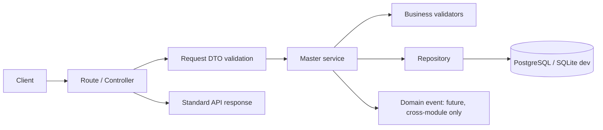
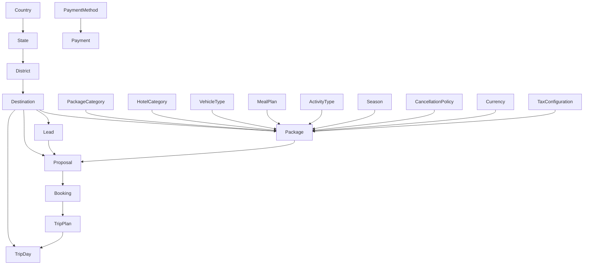

# Master DTOs - Architecture, Data Flow, and Delivery Plan

## Purpose and governing contract

This is the implementation blueprint for the current Master Data workstream.  It is derived from:

- `Amigos_Backend_Implementation_Specification.md` - the frozen backend architecture and delivery rules.
- `api-specification/03_master_dtos.md` - the frozen Master API/DTO contract.
- `database_report.md` - the frozen logical database design.

The Master module owns reusable reference data only. It does not own transactional CRM, booking, operations, or finance behaviour.

## Current-state assessment

### What is already present

- Shared foundation: `BaseModel`, `BaseService`, generic repository, API response envelope, common query helpers, domain exceptions, auth and permissions.
- Implemented master pipelines: `Country`, `State`, and `District` each have model, repository, service, schemas, and routes.
- Existing Alembic revisions add country, state, and district tables.
- The local development database is SQLite (`backend/instance/dev.db`); configuration defaults to SQLite, but production configuration expects `DATABASE_URL`.
- The legacy `app/models.py` holds the broader application model: master, CRM, booking, operations, finance, notifications, audit, and assignment tables.

### Contract gaps to resolve before extending the schema

| Area | Current implementation | Frozen contract / required decision |
|---|---|---|
| Geographic hierarchy | `Country -> State -> District -> City` is being built. | Master DTOs define `Destination` with `country_id` and `state_id`; they do not define City or District. The database report uses a legacy text-based Destination location. Choose and freeze one canonical hierarchy. |
| Destination | Legacy `destinations` table stores text `district`, `city`, `state`, `country`; new City model exists but is not registered. | DTO requires `code`, `slug`, `state_id`, `country_id`, `cover_image`, `display_order`, and audit/version fields. A migration/reconciliation is mandatory; do not silently reuse the legacy table. |
| Master scope | Three geographic entities are built. | `03_master_dtos.md` defines 13 entities. Package, hotel, vehicle, meal, activity, season, cancellation, currency, and tax modules are not yet implemented. |
| API surface | Country, State, District route modules exist. City is not registered in `core/startup.py`. | Every DTO entity requires list, get, create, update, soft-delete, and lookup endpoints. |
| Delete dependencies | District deletion has a placeholder dependency check. | All masters must block deactivation when active dependants exist and return `ERR_ENTITY_IN_USE` / HTTP 409. |
| Database portability | Model code includes PostgreSQL-only partial-index syntax in legacy models while local execution uses SQLite. | Run migrations and integration tests against the intended production database (PostgreSQL) before release. |

**Decision gate:** confirm the canonical location model before Phase 1 below. Recommended model: `Country -> State -> District -> Destination`; eliminate City unless it has a separate confirmed business meaning. `Destination` should reference the hierarchy with FKs, while business tables reference `destination_id` only.

## Database analysis

### Observed database/model state

The current backend has two competing database shapes:

1. The legacy monolithic model in `backend/app/models.py` still defines broad CRM, package, booking, operations, finance, notification, audit, and master tables. In that model, `destinations` stores location as text fields (`district`, `city`, `state`, `country`) and downstream tables reference `destinations.id`.
2. The new modular Master implementation defines normalized geographic masters under `backend/app/modules/master`: `countries`, `states`, `districts`, and `cities`, all extending `BaseModel` with UUID id, audit fields, optimistic `version`, and `is_active`.

This means the database is in a transition state, not a clean modular state. Any new Master DTO work must treat the database as a migration/reconciliation problem first, not only as route/service scaffolding.

### Current master tables and constraints

| Table | Source model | Current key fields | Constraints / indexes | Delivery concern |
|---|---|---|---|---|
| `countries` | `modules/master/country/models.py` | `id`, `name`, `code`, `phone_code`, `description`, `display_order`, audit/version/active | `code` unique and indexed; `is_active` indexed through `BaseModel` | Migration chain alters an existing table; verify fresh-create path. |
| `states` | `modules/master/state/models.py` | `id`, `name`, `code`, `country_id`, `description`, `display_order`, audit/version/active | FK to `countries.id`; unique `(code, country_id)`; country and active indexes | FK lacks explicit `ondelete=RESTRICT` in model, unlike district. Standardize. |
| `districts` | `modules/master/district/models.py` | `id`, `state_id`, `name`, `code`, `description`, `display_order`, audit/version/active | FK to `states.id` with `RESTRICT`; unique `(code, state_id)`; state and active indexes | Approved as implementation master, but not in frozen DTO list. Must be explicitly accepted or removed. |
| `cities` | `modules/master/city/models.py` | `id`, `district_id`, `state_id`, `name`, `code`, `description`, `display_order`, audit/version/active | FK to `districts.id` and `states.id`; unique `(code, state_id)` | Model/routes exist, but City is not part of the frozen Master DTO contract and is not registered as a core API surface. |
| `destinations` | legacy `app/models.py` | `id`, `name`, text `district/city/state/country`, `thumbnail_url`, `best_season`, `tags`, `latitude`, `longitude`, active/delete/audit | Referenced by package, lead, proposal, and operations tables | Does not match target DTO: missing `code`, `slug`, `country_id`, `state_id`, `cover_image`, `display_order`, `version`, and normalized hierarchy. |

### Migration-chain risks

- The baseline Alembic revision `3bd56d5d10dd` assumes existing legacy tables and adds columns to them; it is not a full schema creation baseline.
- Revision `ba379503a783_add_country_master.py` drops legacy business tables (`destinations`, `packages`, `leads`, `bookings`, `payments`, and others) instead of creating the target country table. That is unsafe for any environment with data.
- Revision `941b60de6673_add_countries_table_with_phone_code.py` alters `countries` and drops a `dummy` table, which implies local generated migration history rather than a reviewed production migration path.
- State and district migrations are closer to target shape, but they depend on the prior country history being valid.
- There is no reviewed migration yet for `cities` or for the target `destinations` table.

**Required correction:** before more Master entities are implemented, create a reproducible migration baseline for the intended target schema or rewrite/squash the current local-only migrations before they reach shared environments. No migration should drop business tables as a side effect of adding a master table.

### Destination and consumer dependency analysis

`destinations.id` is already a central FK in the broader model:

| Consumer | Current reference | Dependency impact |
|---|---|---|
| `package_destinations` | `destination_id -> destinations.id` | Blocks destination deactivation while active package mappings exist. |
| `lead_destinations` | `destination_id -> destinations.id` | Blocks hard deletes and should block deactivation if active leads/proposals depend on the destination. |
| `proposal_destinations` | `destination_id -> destinations.id` | Requires migration to preserve proposal history and generated itinerary references. |
| `trip_days` | `overnight_destination_id -> destinations.id` | Requires nullable FK handling and dependency checks before deactivation. |
| Public/admin legacy routes | Read/write legacy destination fields directly | Must be retired or adapted to the new Master Destination service before the DTO contract is considered complete. |

This makes Destination the highest-risk Master entity. It should not be implemented as a brand-new unrelated table unless a deliberate ID mapping strategy is defined. Prefer preserving stable `destinations.id` values where possible, adding normalized FK columns, backfilling them, then removing legacy text columns only after consumers are migrated.

### Recommended target database shape

Use this canonical hierarchy unless the business explicitly needs City as a first-class master:

```text
countries
  id, code, name, phone_code, description, display_order, is_active,
  version, created_at, updated_at, created_by, updated_by

states
  id, country_id, code, name, description, display_order, is_active,
  version, created_at, updated_at, created_by, updated_by
  unique(country_id, code)

districts
  id, state_id, code, name, description, display_order, is_active,
  version, created_at, updated_at, created_by, updated_by
  unique(state_id, code)

destinations
  id, country_id, state_id, district_id, code, slug, name, description,
  cover_image, display_order, latitude, longitude, is_active,
  version, created_at, updated_at, created_by, updated_by
  unique(code), unique(slug)
```

If City is retained, it must be promoted into the frozen API/DTO contract with a clear consumer purpose, and Destination should reference `city_id` in addition to district/state/country. If City is not retained, remove the City module before it becomes an undocumented parallel hierarchy.

### Data reconciliation strategy

1. Snapshot existing `destinations`, `destination_images`, `package_destinations`, `lead_destinations`, `proposal_destinations`, and `trip_days` records.
2. Build a location mapping report from legacy destination text fields to normalized `country_id`, `state_id`, and `district_id`. Every unmapped or ambiguous row must be listed for manual resolution.
3. Add nullable normalized FK columns and new DTO fields to `destinations`.
4. Backfill `code`, `slug`, `country_id`, `state_id`, `district_id`, `cover_image`, `display_order`, `version`, and audit defaults.
5. Validate FK coverage and uniqueness in a migration verification script before adding `NOT NULL` and unique constraints.
6. Update legacy public/admin routes and all business services to read/write through the new Master Destination contract.
7. Only after consumers are migrated, drop or archive legacy text columns (`district`, `city`, `state`, `country`, `thumbnail_url`, `best_season`) according to the approved retention policy.

### DB acceptance checks

- A fresh database can be created from Alembic head without pre-existing legacy tables.
- An existing development database can be migrated without dropping business data.
- PostgreSQL migration execution is verified separately from SQLite.
- All Master FK columns use consistent `RESTRICT` semantics for protected reference data.
- Unique constraints are present at the database layer, not only in service checks.
- Deactivation checks query real consumers and return `ERR_ENTITY_IN_USE` / HTTP 409.
- Seed scripts are idempotent and ordered by FK dependency: country, state, district, destination, simple catalogs, rule catalogs.

## Target design structure

### Module filesystem contract

Each master entity is self-contained and uses the same implementation pipeline:

```text
backend/app/modules/master/<entity>/
  __init__.py          # exports the blueprint
  models.py            # SQLAlchemy table, FKs, constraints, indexes only
  repository.py        # reads/writes, query filters, pagination, lookup projection
  service.py           # transactions and business rules
  validators.py        # reusable entity-specific validation, when needed
  schemas.py           # request and response Marshmallow DTOs
  routes.py            # auth, DTO parsing, response envelope and HTTP status

backend/tests/modules/master/<entity>/
  test_routes.py       # contract/integration coverage
  test_service.py      # business rules and transaction coverage
```

Shared code remains in the existing locations:

```text
app/core/base_model.py                         # id, audit, version, active flag
app/core/base_service.py                       # transaction and optimistic locking helpers
app/infrastructure/persistence/base_repository.py
app/infrastructure/responses/api_response.py
app/common/{pagination,filters,search,sorting}.py
app/validators/common.py
app/workflow/                                  # only for cross-module event handlers
```

### Responsibilities and dependency direction



Rules:

1. Routes authorize, parse DTOs, call one service method, and serialize the response.
2. Services enforce uniqueness, FK/activity checks, hierarchy checks, dependency checks, audit fields, version increments, and transaction boundaries.
3. Repositories perform persistence and query shaping only—no business decisions.
4. Workflows receive events and call services; they never access models/repositories directly.
5. Business modules keep master IDs, never duplicate master labels or location fields.

## Master data model and consumer flow



### Master DTO entity groups

| Group | Entities | Dependency / implementation order |
|---|---|---|
| Geographic | Country, State, District*, Destination | Country → State → District → Destination. *District is an implementation decision, not currently a DTO entity. |
| Simple catalogs | Package Category, Hotel Category, Vehicle Type, Meal Plan, Activity Type, Season, Payment Method, Currency | Independently deployable once common framework is certified. |
| Rule catalogs | Cancellation Policy, Tax Configuration | Implement after base catalogs because they need precise date/percentage validation and future finance/package consumers. |

## API and data flow

### Standard write flow (POST / PUT / DELETE)

```mermaid
sequenceDiagram
  participant U as Admin client
  participant R as Route
  participant S as Service
  participant P as Repository
  participant D as Database
  U->>R: POST /api/v1/masters/{entity}
  R->>R: JWT permission + request DTO validation
  R->>S: create(dto, actor_id)
  S->>P: duplicate / reference / dependency reads
  P->>D: SELECT
  S->>S: enforce business rules; set audit fields
  S->>P: persist entity
  P->>D: transaction commit
  S-->>R: entity
  R-->>U: 201 + Location + standard detail envelope
```

### Standard read flow (list, detail, lookup)

1. Route validates query parameters and permission.
2. Repository uses the shared query helpers for active-default filtering, case-insensitive search, allow-listed sorting, and bounded pagination.
3. List returns `{items, pagination}`; detail returns the full DTO; lookup returns only `id`, `name`, and `code` for active records.
4. All responses use `{success, message, data}`; validation errors use `{success, message, errors}`.

## Phased delivery plan

### Phase M0 — Freeze and reconcile the master schema

- Approve the canonical geographic hierarchy and Destination schema.
- Decide whether the current Alembic history is local-only and should be replaced with a reviewed baseline before shared use.
- Produce a fresh-database migration path that creates the target schema from zero.
- Produce an existing-database migration path that preserves legacy destination and consumer records.
- Map legacy `destinations` data to the target table; define a reversible migration and validation report.
- Decide whether `District` remains an internal geographic master and whether `City` is removed, renamed, or activated.
- Reconcile naming: `cover_image` vs legacy `thumbnail_url`, UUID audit fields vs current `String(36)` audit values, and soft deletion (`is_active` versus `is_deleted`).
- Standardize FK `ondelete` behavior, DB-level uniqueness, nullable-to-required backfill order, and indexes for all master tables.
- Establish PostgreSQL as the migration-test target and retain SQLite only for isolated dev/tests if required.

**Exit criteria:** an approved migration plan, no ambiguous source of truth, a reproducible Alembic head, an updated ER diagram, and a passing migration verification script against both a fresh database and a copied existing database.

### Phase M1 — Certify the shared master framework

- Verify `BaseModel`, `BaseService`, response envelope, base repository, error mapping, JWT permission decorator, and Swagger registration.
- Add the shared lookup route convention and common schema components for audit info, pagination, lookup, and optimistic locking.
- Standardize invalid UUID handling as HTTP 400 (not 404), bounded `page/page_size`, sort-field allow-lists, and rollback on all write failures.
- Create the reusable 19-case master test matrix.

**Exit criteria:** one reference entity passes the full matrix against the chosen database.

### Phase M2 — Geographic foundation

1. Country: validate ISO/business code, lookup, CRUD, soft delete.
2. State: FK and active-country validation; unique `(country_id, code)`.
3. District (if approved): FK and active-state validation; unique `(state_id, code)`; dependency protection.
4. Destination: target DTO schema, hierarchy validation, unique code and slug, package/proposal dependency protection.

**Exit criteria:** clients can populate reliable location dropdowns and all destination consumers use `destination_id`.

### Phase M3 — Independent catalogs

Implement the same six endpoints, five DTOs plus lookup DTO, permissions, migrations, seeds, and tests for:

1. Package Category
2. Hotel Category
3. Vehicle Type
4. Meal Plan
5. Activity Type
6. Season
7. Payment Method
8. Currency

**Exit criteria:** every entity meets the Master DTO contract and can be referenced by package/booking models.

### Phase M4 — Rule-based catalogs

- Cancellation Policy: effective dates, rule lines/percentages if required by the final DTO, overlap validation.
- Tax Configuration: code uniqueness, rate range, effective-date overlap validation, active/default selection rules.

**Exit criteria:** package and finance teams have stable reference records and validation rules.

### Phase M5 — Integration hardening and handoff

- Update Package, CRM, Proposal, Booking, Operations, Finance, and Reports to reference master IDs consistently.
- Add dependency checks for each real consumer before permitting master deactivation.
- Retire or adapt legacy public/admin routes that still read and write monolithic destination/package fields.
- Seed data in FK order; test migration from existing dev data.
- Add OpenAPI coverage and contract tests for every endpoint.
- Add cache invalidation/event hooks only after the synchronous service flow is stable.

**Exit criteria:** no business table persists duplicated master values where an FK is required; master APIs are production-ready.

## Per-entity definition of done

- Model constraints and migration reviewed against the frozen contract.
- `Create`, `Update`, `Summary`, `Detail`, `List`, and `Lookup` DTOs implemented.
- List, detail, lookup, create, update, and soft-delete endpoints documented under `/api/v1/masters`.
- Permission checks use `master.<entity>.read/create/update/delete`.
- Service handles duplicate, inactive FK, hierarchy, optimistic-lock, dependency, and transaction rules.
- Seed data is ordered and idempotent.
- Unit, route/integration, and migration tests pass.
- Swagger/OpenAPI is updated.

## Immediate next task

Proceed with **Phase M0** only: approve the canonical `Destination` hierarchy, decide the fate of City, and repair/baseline the migration strategy. After that decision, the first implementation task is to finish the full Country reference test matrix, then make State and District conform to the same contract before creating or migrating Destination.
