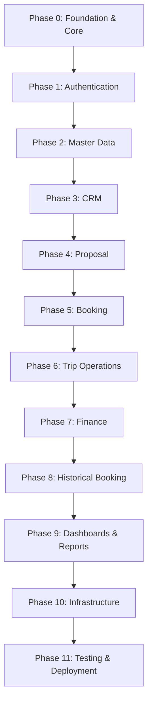

# Backend Upgradation & Refactoring Implementation Plan
## Transitioning Monolithic Flask to Domain-Event-Driven Modular Architecture

This document serves as the final implementation contract for backend refactoring. The database schema, business workflows, folder structure, and domain architectures are frozen. The goal of this plan is to systematically migrate the current monolithic setup (`admin_routes.py`, `public_routes.py`, direct DB query session commits) into the target modular, clean architecture.

---

## 1. Bounded Context Bounding & Folder Structure

```text
backend/app/
├── core/                  # config.py, logging.py, security.py, startup.py, extensions.py
├── domain/                # Shared business concepts, enums, value objects, exceptions
│   ├── events.py          # Domain event constants (BOOKING_CREATED, etc.)
│   ├── enums.py           # Shared domain status enums (LeadStatus, BookingStatus, etc.)
│   ├── value_objects.py   # Cross-cutting value objects (Money, Address, UUIDReference)
│   ├── exceptions.py      # Core domain exception classes (ValidationException, etc.)
│   └── interfaces.py      # Abstract service & repository interfaces
├── infrastructure/        # Shared technical utilities, databases, and third-party integrations
│   ├── database/          # db connection, migrations setup
│   ├── persistence/       # base_repository.py, transaction wrappers
│   ├── responses/         # Standard success/error JSON response envelopes
│   ├── pagination/        # Offset/limit pagination wrappers
│   ├── storage/           # Cloudinary media uploads adaptor
│   ├── notification/      # Alerts Delivery Channels (In-App, Email, WhatsApp adapters)
│   └── integrations/      # razorpay, gmail, maps integrations
├── workflow/              # Workflow Engine (First-Class Orchestration Layer)
│   ├── engine.py          # Event-bus pub-sub dispatch bus registry
│   └── handlers/          # Event Handlers (Orchestrators - NO direct DB/Repo writes)
│       ├── lead_converted.py
│       ├── payment_received.py
│       ├── booking_ready.py
│       ├── booking_cancelled.py
│       ├── booking_completed.py
│       └── historical_booking.py
├── modules/               # Self-contained business feature modules
│   ├── auth/
│   │   ├── routes.py, service.py, repository.py, validator.py, config.py
│   │   └── schemas/ [request.py, response.py]
│   ├── master/            # Master Data Module (completely self-contained folders)
│   │   ├── package/       # [routes.py, service.py, repository.py, validator.py, schemas/request.py, schemas/response.py]
│   │   ├── destination/   # [routes.py, service.py, repository.py, validator.py, schemas/request.py, schemas/response.py]
│   │   ├── vendor/        # [routes.py, service.py, repository.py, validator.py, schemas/request.py, schemas/response.py]
│   │   ├── organization/  # [routes.py, service.py, repository.py, validator.py, schemas/request.py, schemas/response.py]
│   │   └── team/          # [routes.py, service.py, repository.py, validator.py, schemas/request.py, schemas/response.py]
│   ├── crm/               # CRM lifecycle (routes, service, repository, validator, schemas/request.py, schemas/response.py)
│   ├── proposal/          # Proposal Management (routes, service, repository, validator, schemas/request.py, schemas/response.py)
│   ├── booking/           # Future Target Architecture for Modules:
│   │   ├── api/           #     routes.py
│   │   ├── application/   #     service.py
│   │   ├── domain/        #     entities.py, events.py, policies.py
│   │   ├── infrastructure/#     repository.py
│   │   ├── schemas/       #     request.py, response.py
│   │   └── validators/    #     validator.py
│   ├── operations/        # Trip Plans & Logistics
│   ├── finance/           # Reconciliations
│   ├── assignment/        # Cross-cutting module for AssignmentHistory tracking
│   ├── dashboard/         # Aggregated operational stats
│   └── reports/           # Analytical report generation (crm_report, finance_report, operations_report)
└── tests/                 # Isolated test suites
```

---

## 2. Global Engineering & Architectural Rules

### Module Responsibility Matrix
| Module | Owns (Models) | Can Write | Can Read |
| :--- | :--- | :--- | :--- |
| **CRM** | `Lead`, `CRMActivity` | `Lead`, `CRMActivity`, `AssignmentHistory` | `Master`, `Team` |
| **Proposal** | `Proposal`, `ProposalDestination` | `Proposal`, `ProposalDestination` | `CRM` |
| **Booking** | `Booking`, `Traveler`, `PaymentSchedule`, `Document` | `Booking`, `Traveler`, `PaymentSchedule`, `Document`, `AssignmentHistory` | `CRM`, `Proposal` |
| **Operations** | `TripPlan`, `TripDay`, `Checklist`, `VendorAllocation`, `Task` | `TripPlan`, `TripDay`, `Checklist`, `VendorAllocation`, `Task`, `AssignmentHistory` | `Booking` |
| **Finance** | `Expense`, `Payment`, `VendorPayment` | `Expense`, `Payment`, `VendorPayment` | `Booking` |
| **Dashboard** | None (Read-only) | None | All |
| **Reports** | None (Read-only) | None | All |

### "Never Allowed" Architectural Rules
- **Routes $\rightarrow$ Repository** (❌): Routes must never call repositories directly.
- **Repository $\rightarrow$ Repository** (❌): Repositories must never call other repositories.
- **Workflow $\rightarrow$ Repository** (❌): Workflow handlers must never manipulate models or commit query changes directly.
- **Dashboard $\rightarrow$ Domain Models** (❌): Dashboard views are read-only and must strictly consume Read Models/Views (CQRS-lite), never domain models.
- **Reports $\rightarrow$ Transactional Services** (❌): Reports must consume Materialized Views or aggregations, never modifying transactional databases.

### Development Principles
Every backend feature implemented must satisfy the following development pipeline:
$$\text{Requirement} \longrightarrow \text{API Contract} \longrightarrow \text{Validation} \longrightarrow \text{Repository} \longrightarrow \text{Service} \longrightarrow \text{Workflow} \longrightarrow \text{Tests} \longrightarrow \text{Documentation}$$

### 1. Dependency Rule Matrix
| Layer | Can Depend On |
| :--- | :--- |
| **Routes** | Service |
| **Service** | Repository |
| **Repository** | SQLAlchemy |
| **Workflow** | Service |
| **Validator** | DTO |
| **DTO** | Nothing |
| **Domain** | Nothing |

### 2. Circular Dependency Policy
Explicitly prohibited: `CRM -> Booking -> CRM`. Dependencies between modules must always move in one direction.

### 3. Transaction Boundary Rules
Only **Services** may `BEGIN`, `COMMIT`, or `ROLLBACK` transactions. 
- **Repository**: Never commits.
- **Service**: Owns the transaction (Wrapped in a Unit of Work context manager).
- **Workflow**: Never commits.
- **Routes**: Never commit.

### 4. Repository Contract
Every repository should have exactly one responsibility: **One Aggregate = One Repository**. (e.g. `BookingRepository -> Booking Aggregate`). Repositories support only persistence operations. They contain no business logic, no orchestration, and no workflow. Repositories must map ORM state to Domain Entities or DTOs before yielding.

### 5. Workflow Layer Contract
- **Workflow Handler MAY**: Publish events, Call Services, Coordinate modules.
- **Workflow Handler MUST NOT**: Access SQLAlchemy session, Call repositories, Build DTOs, Validate requests, or Commit transactions.

### 6. Dependency Injection (DI)
Services and Repositories must not be hard-instantiated. Utilize a DI container to inject Repositories into Services.

---

## 3. Detailed Architectural Contracts (Governance)

### 3.1 Aggregate Ownership Contract
An **Aggregate Root** is the exclusive entry point for any data mutations within a bounded context. 
| Aggregate Root | Children | Repository | Transaction Owner |
| :--- | :--- | :--- | :--- |
| **Lead** | CRMActivity | LeadRepository | LeadService |
| **Proposal** | ProposalDestination | ProposalRepository | ProposalService |
| **Booking** | Traveler, PaymentSchedule, Document | BookingRepository | BookingService |
| **TripPlan** | TripDay, Checklist, VendorAllocation, Task | TripPlanRepository | OperationsService |

### 3.2 Unit of Work Contract
**One HTTP Request $\rightarrow$ One Unit of Work $\rightarrow$ One Commit**. 
A Service orchestrating a use-case must wrap its entire repository workflow inside a single UnitOfWork. 
*Rule*: Never call `.commit()` multiple times within a single request.

### 3.3 Domain Service vs Application Service
- **Application Service**: Coordinates repositories, owns transactions via UoW, publishes domain events. No business rules.
- **Domain Service**: Contains pure business rules, executes complex domain algorithms. Has no repository access, no transactions, no database commits.

### 3.4 Domain Policy Layer (`policies.py`)
Complex business rules are encapsulated in Policies, rather than leaking into Services. 
*Example*: `BookingPolicy.can_cancel(booking)` instead of `if booking.status == ...` inside `BookingService`.

### 3.5 Repository Return Type Contract
The standardized data flow strictly dictates: 
**Repository $\rightarrow$ ORM Model $\rightarrow$ Application Service $\rightarrow$ DTO Mapper $\rightarrow$ Response DTO**
Repositories must return pure ORM Models to the Service. The Service maps the final ORM state into a Pydantic Response DTO before passing it to the Route.

### 3.6 DTO Mapping Contract
The full request/response cycle is strictly defined as:
**Request DTO $\rightarrow$ Validator $\rightarrow$ Application Service $\rightarrow$ Domain/Repo $\rightarrow$ Response DTO**
DTOs must never leak into Repositories.

### 3.7 Read Model Strategy (CQRS-lite)
**Read Model $\neq$ Domain Entity.**
Dashboard and Reports strictly consume read-only, optimized projections (Views, Materialized Views). They never load transactional Domain Models.

### 3.8 Exception Handling Flow
Exceptions map explicitly to HTTP status codes to guarantee predictable API responses:
- `ValidationException` $\rightarrow$ `HTTP 400 Bad Request` (or `422 Unprocessable Entity`)
- `AuthorizationException` $\rightarrow$ `HTTP 403 Forbidden`
- `DomainException` $\rightarrow$ `HTTP 409 Conflict` (Business rule violation)
- `InfrastructureException` $\rightarrow$ `HTTP 500 Internal Server Error`

### 3.9 Logging & Audit Contract
Standardized logging levels must be used across all modules:
- **Audit Log / Business Action**: `INFO`
- **Workflow Event**: `INFO`
- **Exceptions**: `ERROR` (with full stack trace)
- **Repository Queries**: `DEBUG`

### 3.10 Event & Workflow Specifications

**Event Categorization**
1. **Domain Events**: Core domain transitions (e.g., `LeadAssigned`, `BookingConfirmed`, `TripCompleted`).
2. **Application Events**: Side-effect delivery channels (e.g., `EmailRequested`, `WhatsAppRequested`, `CacheInvalidated`).

**Domain Event Lifecycle (Strict Execution Order)**
1. Persist (Repository)
2. Commit (Unit of Work)
3. Publish Domain Event (Workflow Engine)
4. Publish Application Events (Side effects)
*Rule*: Never publish a Domain Event before the database transaction successfully commits.

**Event Execution Policy**
- **Domain Event**: Blocking (Synchronous processing within the Workflow Engine).
- **Application/Infrastructure Event**: Queued (Asynchronous execution via Celery workers).
- **Analytics Event**: Asynchronous (Eventual consistency).

**Event Publisher-Subscriber Matrix**

| Event | Published By | Subscribers | Actions Triggered |
| :--- | :--- | :--- | :--- |
| `LEAD_ASSIGNED` | CRM | Notification | Dispatches handler alert |
| `PROPOSAL_FINALIZED` | Proposal | Booking | Locks proposal version |
| `ADVANCE_RECEIVED` | Finance | Booking | Creates Booking, generates payment schedule |
| `PAYMENT_RECEIVED` | Finance | Booking, Notification | Updates payment schedule installments |
| `BOOKING_CONFIRMED` | Booking | Operations | Spawns default checklist, notifies Operations Owner |
| `TRIP_READY` | Operations | Notification | Alerts assigned Trip Coordinator |
| `TRIP_COMPLETED` | Operations | Finance | Locks all operational expenses from deletions |
| `BOOKING_CANCELLED` | Booking | Operations, Finance | Reverts vendor allocations, handles refund flags |

### 3.11 Naming Convention Contract
To prevent inconsistent naming, strict suffix conventions are mandated across all modules:
- **Class**: `BookingService`
- **Repository**: `BookingRepository`
- **Validator**: `BookingValidator`
- **Request DTO**: `CreateBookingRequest`
- **Response DTO**: `BookingResponse`
- **Policy**: `BookingPolicy`
- **Event**: `BookingConfirmed`
- **Exception**: `BookingValidationException`

### 3.12 Package Dependency Graph
The holistic dependency flow of the project is strictly top-down:
**API $\rightarrow$ Application $\rightarrow$ Domain $\rightarrow$ Infrastructure $\rightarrow$ Database**
*Note*: The Workflow Engine triggers the **Application** layer, NEVER the Infrastructure layer directly.

### 3.13 Configuration Contract
Direct environment variable access (e.g., `os.getenv()`) is strictly prohibited inside services or domain logic. All configuration must flow exclusively through the centralized `Config` object initialized in `core/config.py`.

### 3.14 Feature Flag Contract
Feature Flags are evaluated exclusively at the **Core Config / API** level. They are read-only toggles and must contain no business logic. Domain models and Repositories should remain completely unaware of feature flags.

### 3.15 Module Public API
Each module must expose an explicit `api.py` (or `__init__.py`) defining its public contract.
*Example*: `BookingService` is exposed publicly, while `BookingRepository`, `BookingPolicy`, and `BookingMapper` remain strictly private internal details of the module.

### 3.16 Mapper Layer Contract
To keep Application Services focused on orchestration, DTO mapping must be explicitly isolated into a `mapper.py` file within each module. 
*Example*: `BookingMapper` converts the ORM Model to the `BookingResponse` DTO, preventing mapping logic from polluting the Service layer.

### 3.17 Domain Entity Rules
- **Entity MAY**: Hold state, enforce internal invariants, and raise domain events.
- **Entity MUST NOT**: Access repositories, send emails, or call external APIs.

### 3.18 Testing Pyramid (Coverage Budget)
To maintain a fast and balanced test suite, test distributions must roughly adhere to:
- **70%** Unit Tests (Domain, Services, Mappers)
- **20%** Integration Tests (Repositories, UoW)
- **10%** Workflow / E2E Tests (Event-bus cascades, API endpoints)

### 3.19 Performance Budget
Expected upper-bound response times (P95) to guide indexing and caching decisions:
- **CRUD Operations**: `< 200ms`
- **Dashboard Loads**: `< 1 second`
- **Complex Reports**: `< 5 seconds`
- **Background Jobs**: `< 30 seconds`

### 3.20 Security Governance
Authorization logic is explicitly barred from the Repository layer. 
The strict flow is: **Application Service $\rightarrow$ Authorization Check $\rightarrow$ Repository**. This prevents security checks from scattering deep into persistence logic.

---

## 4. Refactoring & Upgradation Roadmap (Phase-by-Phase)

*Note on Migration Safety: Every phase dictates a standard rollback plan. If verification fails: Restore legacy route $\rightarrow$ Re-enable feature flag $\rightarrow$ Redeploy.*



### Phase 0: Foundation & Core Setup
- **Migration**: None.
- **Implementation**:
  - Python virtual environment bootstrap: `pip install -r requirements.txt`.
  - Expose extensions to `app/core/extensions.py` (db, migrate, cache, jwt).
  - Setup core constants, domain enums, exceptions, and event constants inside `app/domain/`.
  - Write base repository wrapper in `app/infrastructure/persistence/base_repository.py`.
  - Implement JSON envelope responses in `app/infrastructure/responses/`.
  - Add feature flag toggles (e.g. `FEATURE_AI_ITINERARY = False`) inside `core/config.py`.
- **Workflow**: Initialize `app/workflow/engine.py` event bus.
- **Verification**: Health check `/api/v1/health` returns `200 OK`. `python -m py_compile` succeeds.
- **Cleanup**: None.

---

### Phase 1: Authentication Migration (`app/modules/auth/`)
Dismantle manual token verification from legacy code.
- **Migration**: Extract auth helper checks from `admin_routes.py` lines 14–52 and `/admin/login`.
- **Implementation**:
  - Implement JWT token management in `modules/auth/service.py`.
  - Setup split request/response DTO schemas in `modules/auth/schemas/request.py` and `modules/auth/schemas/response.py`.
  - Setup permissions decorators in `permissions/`.
- **Workflow**: None.
- **Verification**: Protected routes require valid JWT tokens.
- **Cleanup**: Delete legacy login and helper functions from `admin_routes.py`.

---

### Phase 2: Master Data Decomposition (`app/modules/master/`)
Deconstruct monolithic package, destination, organization, vendor, and team routes.
- **Migration**:
  - `public_routes.py` lines 26-48 (`get_destinations`).
  - `public_routes.py` lines 51-120 (`get_packages`, `get_package_by_id`).
  - `admin_routes.py` packages, destinations, vendors, organizations, and team members CRUD routes.
- **Implementation**:
  - Distribute logic into self-contained sub-packages under `app/modules/master/`.
  - Create repositories inheriting from `BaseRepository`.
  - Implement soft delete filters (`is_active = True`).
- **Workflow**: None.
- **Verification**: List and detail queries return correct JSON. Soft delete flag functions identically.
- **Cleanup**: Delete migrated routes from legacy monolithic route files.

---

### Phase 3: CRM Lifecycle Decoupling (`app/modules/crm/`)
Deconstruct Lead pipelines and Activities logs.
- **Migration**: `admin_routes.py` lead status, lead list, activities logging, followup scheduling.
- **Implementation**:
  - Implement CRM repository classes.
  - Implement validators and schemas for Lead and CRMActivity.
  - Integrate **AssignmentService** and write `AssignmentHistory` logs inside lead creation and update services.
- **Workflow**: Integrate `LEAD_ASSIGNED` event handlers to alert team members.
- **Verification**: Lead lifecycle transitions validate successfully.
- **Cleanup**: Delete migrated CRM routes from `admin_routes.py`.

---

### Phase 4: Proposal Pipeline Separation (`app/modules/proposal/`)
Isolate Proposal creation, versioning, and pricing.
- **Migration**: `admin_routes.py` proposal creation, proposal version list, day-by-day destination maps.
- **Implementation**:
  - Implement Proposal repositories.
  - Implement validations: only one final proposal version per lead.
  - Implement proposal immutability checks.
- **Workflow**: Integrate `PROPOSAL_FINALIZED` event.
- **Verification**: Multiple versions created cleanly; final proposal overrides lock correctly.
- **Cleanup**: Delete legacy proposal routes from `admin_routes.py`.

---

### Phase 5: Booking Transactional Service (`app/modules/booking/`)
Implement split payment booking conversion transactions.
- **Migration**: `admin_routes.py` lead-to-booking conversions, payments logging, traveler registration, documents uploading.
- **Implementation**:
  - Create Booking, Traveler, and Payment repositories.
  - Write `BookingService.create_booking()` and `BookingService.confirm_booking()` transaction boundaries.
  - Integrate **AssignmentService** and write `AssignmentHistory` logs for Operations Owner and Trip Coordinator handovers.
  - Validate installment percentages sum to 100%.
  - Save snapshot columns (`package_name_snapshot`, etc.) on Booking creation.
- **Workflow**: Subscribe to `ADVANCE_RECEIVED` to trigger booking generation. Publish `BOOKING_CONFIRMED` event.
- **Verification**: Complete multi-table database transaction rollbacks validated on error.
- **Cleanup**: Delete legacy booking and payment routes from `admin_routes.py`.

---

### Phase 6: Trip Operations Migration (`app/modules/operations/`)
Operational trip planning, vendor allocations, checklists, and tasks.
- **Migration**: `admin_routes.py` tasks creation, checklists verification, vendor allocations.
- **Implementation**:
  - Create TripPlan, TripDay, Checklist, and VendorAllocation repositories.
  - Integrate **AssignmentService** and write `AssignmentHistory` logs for Task assignees.
  - Implement Checklist completion gate (Booking status blocked if checklist incomplete).
  - Implement Vendor allocation lock enforcement (`is_locked = True`).
- **Workflow**: Subscribe to `BOOKING_CONFIRMED` to populate checklist items. Publish `TRIP_READY`.
- **Verification**: Check constraints and allocation locking verified.
- **Cleanup**: Delete legacy operations routes from `admin_routes.py`.

---

### Phase 7: Finance & Dynamic Calculations (`app/modules/finance/`)
Derived financials calculation and expense tracking.
- **Migration**: `admin_routes.py` expense creation, finance reports.
- **Implementation**:
  - Implement dynamic property methods on `Booking` and `VendorAllocation` models (revenue, cost, profit margins) - never persisted.
  - Implement expense mutability checks: prevent deleting expense rows if parent booking status is `Completed` or `Closed`.
- **Workflow**: Subscribe to `TRIP_COMPLETED` to lock expenses.
- **Verification**: Dynamic cost calculations verified. Deletion blocks active.
- **Cleanup**: Delete legacy expense routes from `admin_routes.py`.

---

### Phase 8: Historical Booking Isolation (`app/modules/booking/historical.py`)
- **Migration**: None.
- **Implementation**:
  - Implement dedicated historical service (`historical.py` under booking module) bypassing CRM, Proposal, and Lead workflows.
- **Workflow**: Integrate `HistoricalBookingHandler`.
- **Verification**: Admin-only historical booking entries created correctly with bypassed CRM checks.
- **Cleanup**: None.

---

### Phase 9: Dashboards & Reports (`app/modules/dashboard/`, `app/modules/reports/`)
Operational widgets and analytic summaries. Both modules are strictly read-only and must never perform database writes.
- **Migration**: `admin_routes.py` admin dashboard statistics, monthly reports.
- **Implementation**:
  - Implement Dashboard pre-aggregations in `dashboard/service.py`.
  - Implement separated Report classes (`reports/finance_report.py`, etc.).
- **Workflow**: None.
- **Verification**: Widget loads return sub-second response times.
- **Cleanup**: Delete legacy dashboard endpoints from `admin_routes.py`.

---

### Phase 10: Infrastructure Setup
- **Migration**: None.
- **Implementation**: Configure Celery background workers (`app/jobs/`), Redis caching, and Docker.
- **Workflow**: Integrate `infrastructure/notification/` alerts delivery handlers.
- **Verification**: Async jobs complete successfully.
- **Cleanup**: None.

---

### Phase 11: Quality Assurance & Testing
- **Migration**: None.
- **Implementation**: Write Unit, Integration, and Workflow Event test suites.
- **Workflow**: Validate end-to-end domain event cascades.
- **Verification**: All tests pass successfully.
- **Cleanup**: Final deletion of legacy routes imports from `app/__init__.py`.

---

## 5. Architecture Evolution Roadmap
SaaS/microservice decoupling transitions follow this strict evolutionary roadmap:
$$\text{Modular Monolith} \longrightarrow \text{PostgreSQL DB} \longrightarrow \text{Dockerization} \longrightarrow \text{Redis Caching} \longrightarrow \text{Celery Workers} \longrightarrow \text{RabbitMQ Broker} \longrightarrow \text{S3 Storage} \longrightarrow \text{CI/CD} \longrightarrow \text{Microservices (Only if required)}$$
This sequence prioritizes code clarity, scalability, database maturity, and robustness before introducing complex distributed microservice partitions.
